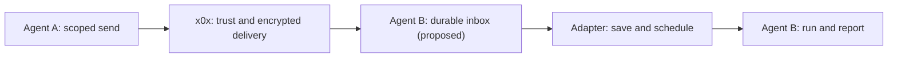

> Historical review from 5 October 2026. State and recommendations below refer
> to the source commit and research date. See [the PR guide](README.md) for the
> agreed follow-up and transition status. The [original HTML](x0x-review.html)
> retains the interactive tables.

Architecture review · 5 October 2026 · discussion draft

# What x0x does. A fresh set of 15 ADRs.

x0x connects people, their machines, and their chosen agents. It supplies identity, permissions, messaging, and shared state. One important part is incomplete: reliable delivery from the daemon to an agent runtime.

This report describes the current design and recommends changes. It does not accept an ADR or change the team plan. It does not certify a release.

**257** tracked documentation files inventoried

**100** numbered ADRs in the snapshot

**88 / 8** Accepted / Proposed decisions

**v0.46.3** latest published release checked

Code and documentation baseline: [eacf68591dff](https://github.com/saorsa-labs/x0x/commit/eacf68591dffcb6f949e2a12bc6f05cfb6e8d481). The working checkout was older; the review used a separate source snapshot. Latest-release publication was checked separately. Main was refreshed and unchanged at the end of research.

## A product definition to agree

> x0x is an owner-controlled network and collaboration layer that lets people, their devices, and their chosen agents find one another, communicate, share selected capabilities and data, and coordinate work across machines.

This follows the accepted direction in [ADR 0095](https://github.com/saorsa-labs/x0x/blob/eacf68591dffcb6f949e2a12bc6f05cfb6e8d481/docs/adr/0095-scope-x0x-is-glue.md). It includes the human, machine, and data-sharing design; agents are first-class participants within it. It is broader than a transport library, while remaining below the reasoning, model selection, and task semantics of an AI runtime.

The product has three authority layers: **the human owner** grants authority; **the agent identity** identifies a participant and its signed actions; **the machine identity** authenticates the transport endpoint. A user key is optional and must be explicitly created. A process, model name, and cryptographic agent identity are different things. The same hosted model may serve several distinct agents with different permissions. [ADR 0007](https://github.com/saorsa-labs/x0x/blob/eacf68591dffcb6f949e2a12bc6f05cfb6e8d481/docs/adr/0007-three-layer-identity-model.md) [ADR 0036](https://github.com/saorsa-labs/x0x/blob/eacf68591dffcb6f949e2a12bc6f05cfb6e8d481/docs/adr/0036-owner-singleton-and-naming-registry.md) [ADR 0039](https://github.com/saorsa-labs/x0x/blob/eacf68591dffcb6f949e2a12bc6f05cfb6e8d481/docs/adr/0039-agent-harness-boundary.md)

**Home is private to one owner.** Sharing an agent or capability with another human should not implicitly share Home, the owner's key, or all of the owner's other agents. Group admins have substantial group authority; they are not merely cosmetic moderators. [ADR 0016](https://github.com/saorsa-labs/x0x/blob/eacf68591dffcb6f949e2a12bc6f05cfb6e8d481/docs/adr/0016-role-based-group-authority-flat-admin.md) [ADR 0038](https://github.com/saorsa-labs/x0x/blob/eacf68591dffcb6f949e2a12bc6f05cfb6e8d481/docs/adr/0038-home-owner-certified-personal-space.md) [ADR 0070](https://github.com/saorsa-labs/x0x/blob/eacf68591dffcb6f949e2a12bc6f05cfb6e8d481/docs/adr/0070-owner-trust-and-share-grants.md)

x0x is not a global data-storage network, a general IP VPN, or an AI hosting service. Data availability depends on reachable authorized holders and retention. Direct connectivity can require relays. Owner authority and bounded delegation must remain meaningful even when the application is an autonomous agent. [ADR 0006](https://github.com/saorsa-labs/x0x/blob/eacf68591dffcb6f949e2a12bc6f05cfb6e8d481/docs/adr/0006-no-global-dht-for-user-and-group-data.md) [ADR 0071](https://github.com/saorsa-labs/x0x/blob/eacf68591dffcb6f949e2a12bc6f05cfb6e8d481/docs/adr/0071-relay-backbone-shipped-truth-and-deferred-work.md) [ADR 0074](https://github.com/saorsa-labs/x0x/blob/eacf68591dffcb6f949e2a12bc6f05cfb6e8d481/docs/adr/0074-tailnet-phase-2-names-persistent-forwards-socks5.md) [ADR 0095](https://github.com/saorsa-labs/x0x/blob/eacf68591dffcb6f949e2a12bc6f05cfb6e8d481/docs/adr/0095-scope-x0x-is-glue.md)

## Capability map

“Present” below means a documented implementation exists in the pinned source. It does not mean every failure mode has passed a current end-to-end test, or that later main-branch changes are in v0.46.3.

| Capability | Present foundation | Boundary or remaining work |
| --- | --- | --- |
| Identity and trust | Machine / agent / optional owner identities; certificates, contact trust, owner enrollment and scoped grants. | Consolidated authority checks, durable relationship evidence, complete revocation and lost-device recovery remain active work. [ADR 0089](https://github.com/saorsa-labs/x0x/blob/eacf68591dffcb6f949e2a12bc6f05cfb6e8d481/docs/adr/0089-relationship-peer-evidence-survives-restart.md) [#1107](https://github.com/saorsa-labs/x0x/issues/1107) [#1108](https://github.com/saorsa-labs/x0x/issues/1108) [#1116](https://github.com/saorsa-labs/x0x/issues/1116) |
| Machine connectivity | ant-quic transport, discovery, NAT traversal, byte streams and controlled loopback TCP forwarding. | Not an IP-level Tailscale replacement today. Friendly names, persistent forwards and SOCKS5 are a separately accepted Phase 2 design. Better connectivity and lower cost require measurements. [ADR 0020](https://github.com/saorsa-labs/x0x/blob/eacf68591dffcb6f949e2a12bc6f05cfb6e8d481/docs/adr/0020-tailnet-phase-1-byte-streams-and-forwarding.md) [ADR 0022](https://github.com/saorsa-labs/x0x/blob/eacf68591dffcb6f949e2a12bc6f05cfb6e8d481/docs/adr/0022-tailnet-stream-api.md) [ADR 0074](https://github.com/saorsa-labs/x0x/blob/eacf68591dffcb6f949e2a12bc6f05cfb6e8d481/docs/adr/0074-tailnet-phase-2-names-persistent-forwards-socks5.md) [#960](https://github.com/saorsa-labs/x0x/issues/960) |
| Messaging | Gossip pub/sub, DMs, group messages, signed attribution, durable local history, live SSE/WS and bounded backfill. | Durable receipt is not agent consumption. Timeout after remote commit can leave the caller uncertain. [ADR 0023](https://github.com/saorsa-labs/x0x/blob/eacf68591dffcb6f949e2a12bc6f05cfb6e8d481/docs/adr/0023-durable-local-history.md) [ADR 0030](https://github.com/saorsa-labs/x0x/blob/eacf68591dffcb6f949e2a12bc6f05cfb6e8d481/docs/adr/0030-dm-durable-application-ack-v2.md) [#1109](https://github.com/saorsa-labs/x0x/issues/1109) |
| Private groups and teams | Signed membership state, roles, invites, TreeKEM and legacy GSS paths, secure group data. | Owner-offline operation, any-holder repair, departure rekey and avoiding unwanted Home changes are substantial unfinished work. [ADR 0088](https://github.com/saorsa-labs/x0x/blob/eacf68591dffcb6f949e2a12bc6f05cfb6e8d481/docs/adr/0088-group-liveness-contract.md) [ADR 0108](https://github.com/saorsa-labs/x0x/blob/eacf68591dffcb6f949e2a12bc6f05cfb6e8d481/docs/adr/0108-home-scoped-owner-certificate.md) [ADR 0110](https://github.com/saorsa-labs/x0x/blob/eacf68591dffcb6f949e2a12bc6f05cfb6e8d481/docs/adr/0110-revocation-eviction-designated-first.md) [ADR 0111](https://github.com/saorsa-labs/x0x/blob/eacf68591dffcb6f949e2a12bc6f05cfb6e8d481/docs/adr/0111-evidence-size-k-and-fetch-by-hash.md) [ADR 0112](https://github.com/saorsa-labs/x0x/blob/eacf68591dffcb6f949e2a12bc6f05cfb6e8d481/docs/adr/0112-any-admin-invite-redemption.md) [ADR 0113](https://github.com/saorsa-labs/x0x/blob/eacf68591dffcb6f949e2a12bc6f05cfb6e8d481/docs/adr/0113-home-is-an-explicit-owner-group-adopted-in-place.md) |
| Agent attachment | Harness-owned identities and scoped API riders; structured mentions; delegation; partial A2A binding. | Rider tokens cannot receive live events through the subscription routes. “ACP-attached” is not an implemented ACP protocol bridge. A2A streaming and push flags remain false. See the next section. |
| Shared data and coordination | Replicated KV stores, task lists, group encryption, file transfer, board UI. | Task claims are advisory. The scoped scratch-store product is planned; rich collaborative text is parked. KV convergence is not text-merge semantics or universal data custody. [ADR 0047](https://github.com/saorsa-labs/x0x/blob/eacf68591dffcb6f949e2a12bc6f05cfb6e8d481/docs/adr/0047-crdt-kv-store-delta-gossip.md) [ADR 0048](https://github.com/saorsa-labs/x0x/blob/eacf68591dffcb6f949e2a12bc6f05cfb6e8d481/docs/adr/0048-crdt-task-list-coordination.md) [#1094](https://github.com/saorsa-labs/x0x/issues/1094) [#965](https://github.com/saorsa-labs/x0x/issues/965) |
| Human interaction and media | Embedded GUI; library voice work behind an optional feature; experimental call-signaling lifecycle. | No released complete voice/video calling product. Browser media gateway and rich-text notes remain parked under the current scope decision. Agent-initiated GUI show has its own accepted design and implementation hold. [ADR 0042](https://github.com/saorsa-labs/x0x/blob/eacf68591dffcb6f949e2a12bc6f05cfb6e8d481/docs/adr/0042-voice-media-over-tailnet-streams.md) [ADR 0073](https://github.com/saorsa-labs/x0x/blob/eacf68591dffcb6f949e2a12bc6f05cfb6e8d481/docs/adr/0073-audio-and-video-calling.md) [ADR 0083](https://github.com/saorsa-labs/x0x/blob/eacf68591dffcb6f949e2a12bc6f05cfb6e8d481/docs/adr/0083-agent-initiated-gui-show.md) [ADR 0095](https://github.com/saorsa-labs/x0x/blob/eacf68591dffcb6f949e2a12bc6f05cfb6e8d481/docs/adr/0095-scope-x0x-is-glue.md) |
| Remote machine actions | Opt-in exec with fail-closed ACL; controlled forwarding and scoped sharing. | Messaging or an @mention must never itself grant permission to run commands. Grant, caller, target and local policy still govern the action. [ADR 0019](https://github.com/saorsa-labs/x0x/blob/eacf68591dffcb6f949e2a12bc6f05cfb6e8d481/docs/adr/0019-connect-acl-default-closed.md) [ADR 0046](https://github.com/saorsa-labs/x0x/blob/eacf68591dffcb6f949e2a12bc6f05cfb6e8d481/docs/adr/0046-exec-service-fail-closed-acl.md) [ADR 0070](https://github.com/saorsa-labs/x0x/blob/eacf68591dffcb6f949e2a12bc6f05cfb6e8d481/docs/adr/0070-owner-trust-and-share-grants.md) |
| Maintenance and efficiency | Signed releases, update propagation, diagnostics, Leaf participation and resource controls. | Safe apply/recovery, stronger health truth, owner-governed maintenance and measured efficiency budgets are ongoing. Publication is not rollout proof. [ADR 0094](https://github.com/saorsa-labs/x0x/blob/eacf68591dffcb6f949e2a12bc6f05cfb6e8d481/docs/adr/0094-m2-safe-apply.md) [ADR 0096](https://github.com/saorsa-labs/x0x/blob/eacf68591dffcb6f949e2a12bc6f05cfb6e8d481/docs/adr/0096-r12-x0x-is-maintained-by-its-own-agents.md) [#1167](https://github.com/saorsa-labs/x0x/issues/1167) [#1172](https://github.com/saorsa-labs/x0x/issues/1172) |

**Two security promises need precision.** Encrypted transport, encrypted group content, and encrypted local disks are separate properties: [ADR 0015](https://github.com/saorsa-labs/x0x/blob/eacf68591dffcb6f949e2a12bc6f05cfb6e8d481/docs/adr/0015-no-app-layer-at-rest-encryption.md) delegates local at-rest protection to the OS. Post-quantum algorithms alone do not prove forward secrecy. They also do not prove recovery after a key is stolen. The DM path encapsulates to the recipient KEM key; a Signal-style continuous DM ratchet was not established by this review. [DM encryption and decryption](https://github.com/saorsa-labs/x0x/blob/eacf68591dffcb6f949e2a12bc6f05cfb6e8d481/src/dm.rs#L1591)

Likewise, removing a member from a roster is not sufficient proof that it lost the ability to decrypt later group traffic. The current self-leave/rekey gap is explicitly tracked by [#1113](https://github.com/saorsa-labs/x0x/issues/1113) and proposed [ADR 0110](https://github.com/saorsa-labs/x0x/blob/eacf68591dffcb6f949e2a12bc6f05cfb6e8d481/docs/adr/0110-revocation-eviction-designated-first.md). The promised security property must be gated by cryptographic exclusion, not just a UI membership change.

## Agent notifications: the concrete gap

**An agent should receive work without repeated checks or a human copying the message into its conversation.** The receiver must verify the sender. It must save the event and recover it after a restart. The runtime must then receive the event and start work. A successful network send does not prove that the runtime did this.

| Attachment | What the code establishes | What remains |
| --- | --- | --- |
| Local owner-authorized client | Can consume WS/SSE. Direct SSE and WS have bounded history backfill. | The direct SSE handler emits no stable SSE event ID / resume cursor. Live queues can shed events. Backfill is not a persistent inbox with a separate acknowledgment for each agent. [SSE handler](https://github.com/saorsa-labs/x0x/blob/eacf68591dffcb6f949e2a12bc6f05cfb6e8d481/src/server/sse.rs#L169) [WS queue policy](https://github.com/saorsa-labs/x0x/blob/eacf68591dffcb6f949e2a12bc6f05cfb6e8d481/src/server/ws.rs#L374) [Local event backpressure](https://github.com/saorsa-labs/x0x/blob/eacf68591dffcb6f949e2a12bc6f05cfb6e8d481/docs/local-apps.md) |
| API rider | Only group send, secure encrypt and bounded GET /history are allowlisted. Every group must be explicitly granted. | No WS/SSE subscription, direct-send route, or durable consumer acknowledgment in this scope. Opening all of /ws or issuing the owner token would bypass the intended isolation. [Rider route allowlist](https://github.com/saorsa-labs/x0x/blob/eacf68591dffcb6f949e2a12bc6f05cfb6e8d481/src/server/rider_auth.rs#L119) [Route rejection](https://github.com/saorsa-labs/x0x/blob/eacf68591dffcb6f949e2a12bc6f05cfb6e8d481/src/server/auth.rs#L199) |
| “ACP-attached” identity | The harness owns its key and participates via its own daemon/library instance. | This defines the identity and who holds its key. The x0x source does not implement the ACP session/prompt → session/update bridge for arbitrary attached runtimes. [ADR 0039](https://github.com/saorsa-labs/x0x/blob/eacf68591dffcb6f949e2a12bc6f05cfb6e8d481/docs/adr/0039-agent-harness-boundary.md) [Harness integration](https://github.com/saorsa-labs/x0x/blob/eacf68591dffcb6f949e2a12bc6f05cfb6e8d481/docs/local-apps.md) |
| A2A integration | Agent-card projection and unary request/reply binding. | Streaming and pushNotifications remain explicitly false. The broader interoperability issue is closed/deferred, not completed. [Capability flags](https://github.com/saorsa-labs/x0x/blob/eacf68591dffcb6f949e2a12bc6f05cfb6e8d481/src/a2a/mod.rs#L234) [Unary binding](https://github.com/saorsa-labs/x0x/blob/eacf68591dffcb6f949e2a12bc6f05cfb6e8d481/src/a2a/binding.rs) [#112](https://github.com/saorsa-labs/x0x/issues/112) |
| Hosted model API | x0x can communicate with an application that calls the API. | A model API does not listen on the x0x network. An authorized adapter must receive the event, select the conversation and call the API. This adapter controls cost, parallel work and runtime policy. |

Structured mentions already exist, and they are useful. They are event routing information—not an invocation guarantee or authorization to execute a task. [Delegation and mention implementation notes](https://github.com/saorsa-labs/x0x/blob/eacf68591dffcb6f949e2a12bc6f05cfb6e8d481/docs/design/adr-0040-mechanics.md)

### Name the receipts

- **Queued durably at sender:** the sender accepted responsibility, within its stated retention and expiry contract.

- **Committed at recipient:** the recipient verified and durably recorded the message. DM-v2 ACK includes history commit and local dispatch; it does not mean an external agent consumed it. [ADR 0030](https://github.com/saorsa-labs/x0x/blob/eacf68591dffcb6f949e2a12bc6f05cfb6e8d481/docs/adr/0030-dm-durable-application-ack-v2.md)

- **Accepted by consumer:** the agent adapter persisted enough state to resume after a crash.

- **Started:** the selected runtime began the work.

- **Completed / refused / failed / expired:** an explicit application outcome.

The last three require a consumer/runtime contract. Human “read” and an OS notification are separate signals again. Do not rename the existing durable DM acknowledgment to imply stronger semantics.

### The smallest useful contract to add

- **Per-agent durable consumption.** Stable event IDs, a durable consumer identity, resumable position and explicit acknowledgment. Independent agents have independent consumption positions. Multiple workers for one agent need an explicit shared-consumer policy.

- **At-least-once delivery, idempotent handling.** Redeliver unacknowledged events. The adapter persists the event-to-run mapping before acknowledging. External effects need their own idempotency or fencing; an inbox cannot make an arbitrary shell command exactly-once.

- **Scoped send and receive.** Events are filtered by the authenticated agent, event type and permitted group/task. Recheck current authorization on replay and delivery. Revocation terminates affected live subscriptions. Decide separately whether API riders gain direct inboxes or remain group-only.

- **Bounded obligations with visible failures.** Disk, bytes, event count, TTL, attempts and per-agent budgets. Admission must refuse when it cannot retain the promised obligation. Retention gaps need an explicit resync-required result; no silent move to the newest event.

- **One delivery implementation.** Reuse the planned common Outbox<T> and existing durable history where their contracts fit. Inbox consumption is a distinct responsibility, but should share the reliability machinery rather than add another bespoke retry queue. ADR 0090 is still a provisional planned record, not an accepted file in this snapshot.

- **A small adapter boundary.** x0xd authenticates, persists, routes and reports delivery. An external adapter binds the event to a runtime session and starts work under owner policy. Start with one native API client and one ACP adapter. Add A2A task push as interoperability work after the native contract is proven.

- **Honest readiness.** Distinguish machine reachable, daemon reachable, adapter connected, and agent ready/busy. Queue by default when busy; interrupt only under a supported, explicit policy. Cap automated reply loops, fan-out and model spend.

A useful envelope contains an event ID and type, authenticated source/destination, applicable group/task, correlation and causation IDs, expiry, and a payload or content reference. Keep transport delivery state separate from task state. Prefer standard envelope conventions where practical; no new message language is required. This paragraph is a proposal, not an existing wire format.

**Offline has two cases.** If the adapter is offline but its daemon is up, the durable local inbox can retain work. If every authorized destination device is offline, a sender can retry within policy; guaranteed immediate delivery requires some reachable custodian. An owner could choose an encrypted service that holds and forwards messages. This needs a separate decision about who holds the data and for how long. Push cannot wake a powered-off machine by itself.

**Shared task lists need a separate execution rule.** Two replicas may both locally accept a claim before convergence chooses a winner. An agent team doing irreversible work needs an execution authority or external effect fence appropriate to that work. Receiving a task event and seeing a CRDT claim are not proof of exclusive ownership. [Advisory claim contract](https://github.com/saorsa-labs/x0x/blob/eacf68591dffcb6f949e2a12bc6f05cfb6e8d481/tests/convergence/README.md#L90)

### Acceptance scenarios for the missing handoff

- Send to an authorized rider while its adapter is running: delivery starts the intended agent, using only the rider's own credential.

- Stop the adapter, send work, restart it: replay occurs without asking the sender to recreate the message.

- Crash after consumer persistence but before acknowledgment: redelivery maps to the same run or deduplicated effect.

- Restart the daemon and reconnect from a cursor: no silent gap at the history/live boundary.

- Revoke the rider or remove it from the group during a connection and during replay: later delivery is refused; another agent's history is never exposed.

- Keep the runtime busy or rate-limited: work remains queued with a visible reason and bounded policy.

- Fill disk/queue or let work expire: the sender or consumer sees a queryable refusal/terminal state, not false success.

- Lose the sender response after recipient commit: querying the stable logical ID distinguishes committed work from work safe to retry.

- Repeat with a cold binding cache, owner device offline, packet loss, partitions and delayed membership evidence.

- Exercise one real ACP runtime and one real external API adapter; advertise only the protocol capabilities those tests establish.

Latency and resource budgets should be measured and then agreed. These are proposed acceptance cases, not tests executed in this review.

## What current practice suggests

This is a standards and architecture comparison, not a measured claim that one whole stack is “best.” The recommendations below are my synthesis of the primary sources and x0x's existing direction.

| Area | Current reference | Implication for x0x |
| --- | --- | --- |
| ACP | [ACP v1 prompt turns](https://agentclientprotocol.com/protocol/v1/prompt-turn) use client-initiated session/prompt and agent-originated session/update. | An adapter can translate an authorized inbox event into a prompt turn. Session updates are not a durable inbound mailbox. |
| A2A | [A2A specification](https://a2a-protocol.org/latest/specification/) defines task polling, streaming and capability-gated HTTP push callbacks. Retrying a failed callback is optional. | Advertise only supported features. A webhook does not prove that an agent saved or started the work. The adapter must retain the x0x delivery guarantees. |
| MCP | [MCP 2026-07-28 Streamable HTTP](https://modelcontextprotocol.io/specification/2026-07-28/basic/transports/streamable-http) has subscriptions/listen, request-scoped SSE, and no Last-Event-ID stream resumption. | Pin the revision. Do not design around an old GET/SSE session model or treat MCP notifications as a crash-recoverable agent inbox. Tools and resources complement x0x messaging. |
| Durable events | [JetStream consumers](https://github.com/nats-io/nats.docs/blob/master/nats-concepts/jetstream/consumers.md) separate retained streams from consumer delivery and acknowledgments. [CloudEvents](https://github.com/cloudevents/spec/blob/main/cloudevents/spec.md) standardizes event-envelope attributes. | Borrow explicit acknowledgment, replay and redelivery semantics; a central NATS deployment is not required. An envelope standard alone gives no delivery guarantee. |
| P2P networking | [Iroh protocols](https://www.iroh.computer/proto) separate endpoint networking, gossip, blob transfer and document sync. [Tailscale connection types](https://tailscale.com/docs/reference/connection-types) distinguish direct, peer-relay and DERP paths. | Keep the transport modular and expose the actual path. Benchmark cold connect, blocked-UDP environments, loss, roaming and battery cost before claiming superior reach or efficiency. |
| Secure messaging | [Signal SPQR](https://signal.org/blog/spqr/) addresses ongoing post-quantum ratcheting. [MLS RFC 9420](https://datatracker.ietf.org/doc/html/rfc9420) specifies group forward secrecy and post-compromise security; [MLS PQ ciphersuites](https://datatracker.ietf.org/doc/draft-ietf-mls-pq-ciphersuites/) remain draft work. | Distinguish PQ authentication/KEM from ratcheted confidentiality, group exclusion and formal wire interoperability. Verify saorsa-mls properties rather than inferring them from its name. |
| Shared state | [Loro synchronization](https://www.loro.dev/docs/tutorial/sync) and [Automerge local sync](https://automerge.org/docs/tutorial/local-sync/) separate local state, change exchange and persistence. | Durable change exchange and repair matter as much as a live notification. Keep KV, collaborative text and security membership as different state machines. Existing Loro direction does not need reopening merely because alternatives exist. |
| Voice/video | [SFrame RFC 9605](https://www.rfc-editor.org/rfc/rfc9605.html) permits content encryption through an SFU. [Media over QUIC Transport](https://datatracker.ietf.org/doc/draft-ietf-moq-transport/) is still an Internet-Draft. | Retain x0x identity and authorization, but keep realtime media separate from durable work delivery. Browser interoperability and multi-party forwarding need their own tested design; do not distribute video frames through the work inbox. |
| Updates | [The Update Framework](https://theupdateframework.github.io/specification/latest/) separates signing roles and addresses rollback, freeze and metadata attacks. | Compare the signed-release threat model against TUF. Its metadata protections complement the local transactional rollback and supervisor recovery being built under ADR 0094. |
| Human/mobile push | [Apple background notifications](https://developer.apple.com/documentation/usernotifications/pushing-background-updates-to-your-app) are not guaranteed and may be throttled. | An OS alert is a wake hint; the application must retrieve durable state. Keep device notification, agent consumption and human read receipts distinct. |

**Assessment:** x0x's value is the combination of owner authority, local daemons, peer reach and shared collaboration state. The next major gain comes from dependable integration and clear contracts, rather than adding another protocol or another cryptographic primitive.

## Fit the recommendation around work already in flight

The live snapshot contained seven open PRs and 88 open issues. The local team plan identifies a controller, a release manager, serialized changes to hot files, and a harness-first rule for group/Home liveness. This review did not send instructions to those teams or modify their work.

| Current lane | Evidence checked | Relationship to this review |
| --- | --- | --- |
| v0.46.x repairs | [#1222](https://github.com/saorsa-labs/x0x/pull/1222) targets cold verified-binding waits for [#1207](https://github.com/saorsa-labs/x0x/issues/1207) and [#1217](https://github.com/saorsa-labs/x0x/issues/1217); open. | Continue the targeted repair. It improves peer delivery but does not add agent-runtime consumption. |
| W3 simulation harness | [#1234](https://github.com/saorsa-labs/x0x/pull/1234) is a draft for [#1164](https://github.com/saorsa-labs/x0x/issues/1164); initial daemon simulation work. | Use this foundation for restart, ordering, loss and group-recovery evidence. Do not mistake the first harness slice for completed acceptance. |
| Group authority and liveness | [#1243](https://github.com/saorsa-labs/x0x/pull/1243) moves the admin/mutation family through GroupAccess; S2 already merged. [#1165](https://github.com/saorsa-labs/x0x/issues/1165) tracks the wider liveness work. | New subscriptions should use the same authorization boundary. Finish existing liveness slices instead of inventing a parallel membership mechanism. |
| Common delivery machinery | Team lane 3 plans Outbox<T> after its governing ADR; lane 4 plans the digest beacon after its ADR. | The agent delivery requirement should be an input to this design. It must not create an extra ad-hoc queue in a patch. |
| M2 safe apply | Draft [#1235](https://github.com/saorsa-labs/x0x/pull/1235) and [#1237](https://github.com/saorsa-labs/x0x/pull/1237) cover test/verification fixtures and release-signing workflow integration. | Keep these independent safety gates. A notification adapter cannot compensate for a broken daemon upgrade. |
| Future-version / parked work | Draft [#1188](https://github.com/saorsa-labs/x0x/pull/1188) and [#1184](https://github.com/saorsa-labs/x0x/pull/1184) are held for v0.47; calling [#892](https://github.com/saorsa-labs/x0x/issues/892) and notes [#965](https://github.com/saorsa-labs/x0x/issues/965) remain parked. | This review does not change the scope or priority. |

The team should also assess the new delivery and evidence reports: [#1238](https://github.com/saorsa-labs/x0x/issues/1238) concerns slow work inside the metadata listener; [#1239](https://github.com/saorsa-labs/x0x/issues/1239) concerns blocking work in direct sends; [#1240](https://github.com/saorsa-labs/x0x/issues/1240), [#1241](https://github.com/saorsa-labs/x0x/issues/1241) and [#1242](https://github.com/saorsa-labs/x0x/issues/1242) concern evidence lifecycle, admission and bounds. These are issue reports and investigation inputs, not fresh independently reproduced runtime findings from this review.

Keep the current release and security work moving. Agree how agents receive and accept events. Add this requirement to the shared delivery and permission designs. Prove one native client and one adapter. Then add other protocol adapters. Full A2A task semantics remain distinct from the core requirement that an attached agent can receive its own events.

## Archive the old set. Keep at most 15 current ADRs.

**I recommend this change, with a controlled transfer of decisions.** The current set has 100 numbered records and about 1.65 MB of ADR text. A new engineer or agent should not need to read that history to understand x0x.

I suggest that the limit means **15 current decision records**. Archived records and old revisions do not count towards this limit. Use stable IDs A01–A15 so that new references cannot be confused with old ADR 0001–0114.

This is more than a file move. The fresh records should state the architecture we want to keep. They must show where that architecture is implemented, incomplete or still awaiting a decision. An old Accepted record does not make every feature in its replacement complete.

| ID | Fresh ADR | Decision boundary | Old records mapped |
| --- | --- | --- | --- |
| A01 | Purpose and product limits | x0x connects people, machines and agents. Define core work, parked work, and explicit non-goals. | 4 |
| A02 | Identity, keys and device enrollment | Separate owner, agent and machine identities. Define key custody, placement, enrollment and local key protection. | 7 |
| A03 | Trust, permissions, sharing and revocation | Use one authority model. Define scoped grants, command permission, revocation and lost-device response. | 8 |
| A04 | Agent attachment and inbound events | Define API riders and key-owning agents. Require a scoped durable inbox and a clear boundary between x0xd and runtime adapters. | 1 |
| A05 | Connectivity, discovery and names | Define peer discovery, direct paths, NAT traversal, byte streams, forwarding and local names. | 11 |
| A06 | Gossip, relay roles and resource limits | Define Leaf and backbone duties, overload behavior and measured limits for network, CPU, memory and queues. | 8 |
| A07 | Messages, receipts, history and retry | Define signed messages, stable IDs, receipt levels, replay, retention and the common durable delivery mechanism. | 7 |
| A08 | Groups, Home, membership and repair | Define group roles and Home. State join, catch-up, fork, offline-admin and recovery rules. | 21 |
| A09 | Group encryption and key changes | Define encryption epochs, who can receive keys, departure rekey and the move from legacy GSS to TreeKEM. | 6 |
| A10 | Shared data, files and synchronization | Define data holders, KV, files, owner sync, scratchpads and text-merge limits. Keep parked notes separate from current features. | 7 |
| A11 | Local API, applications and human interface | Define REST/WS/SSE, token classes, local applications, the GUI and agent-opened views. | 4 |
| A12 | Agent teams, delegation and task coordination | Define team collaboration and bounded delegation. State that a converged task claim does not prove exclusive execution. | 2 |
| A13 | Voice and video | Define call signaling, media paths, browser support and group-call security. Retain the current parked priority. | 3 |
| A14 | Health, updates and recovery | Define health evidence, signed updates, safe apply, rollback and maintenance under owner policy. | 6 |
| A15 | Compatibility, validation and decision rules | Define wire/storage versions, capability negotiation, release evidence, human acceptance and the 15-record limit. | 5 |

All 100 old records have one proposed primary home in the searchable map below. A decision can affect other areas; those areas should link to its owner instead of restating it. **This is a complete record-level map, not yet a clause-by-clause transfer or 15 completed ADR drafts.**

### Keep the 15 records short

Target 500–1,000 words per record. Treat 1,500 words as a review limit. Each record should contain: context, the decision, rejected alternatives, key guarantees, consequences, and references to exact supporting specifications.

Put byte layouts, full state machines, API schemas, test evidence and work plans in separate maintained documents. These documents are specifications or evidence, not extra ADRs under a different name. An ADR must retain its important authority, privacy, delivery and compatibility guarantees. A supporting document must not weaken them silently.

Keep one short “Start here” page outside the ADR set. It gives the product definition, current capability status and links to the 15 decisions. This is a reading guide, not a sixteenth decision.

### Change a revision, not the number of current ADRs

When a decision changes, propose a new revision of the relevant slot: for example, A07 revision 2. David accepts the new revision. The old accepted revision remains unchanged in the archive. A current-version index points to the new accepted revision. No agent can accept a revision or add A16.

This requires an explicit change to the present governance rules. The current [AGENTS.md](https://github.com/saorsa-labs/x0x/blob/eacf68591dffcb6f949e2a12bc6f05cfb6e8d481/AGENTS.md#L70) says accepted ADRs are immutable. The [CI validator](https://github.com/saorsa-labs/x0x/blob/eacf68591dffcb6f949e2a12bc6f05cfb6e8d481/scripts/adr-governance.py#L43) expects four-digit filenames directly under docs/adr and checks deletion and mutation. Its [tests](https://github.com/saorsa-labs/x0x/blob/eacf68591dffcb6f949e2a12bc6f05cfb6e8d481/scripts/test_adr_governance.py) also guard against rename-and-rewrite. Do not disable those checks to move the files. Extend them to preserve accepted versions and verify the new current-version index.

### Transfer decisions in four steps

- **Agree the 15 boundaries and revision rule.** These are proposals. The fresh inbound-agent guarantee in A04 is a new requirement, not a summary of shipped behavior.

- **Draft the new set beside the old set.** For each old record and its important clauses, mark: carried forward, changed by an accepted later decision, retired, or still open. Preserve Proposed status for unresolved designs. Give rejected and superseded records a historical disposition; do not restore them by accident.

- **Review the transfer with the active lanes.** Existing PRs keep their original governing references. Add the new mapping without changing their acceptance gates. Review group security, delivery, revocation and storage compatibility as explicit transfer checks.

- **Switch the main reading path after acceptance.** Mark the old set as the historical archive in its index. Keep its existing paths initially. A later physical move needs preserved links, exact file hashes, paired grounding records, CI updates and the documentation mirror update. Do not combine that move with a protocol change.

The source scan found ADR references in 158 Rust source files and 44 test files, plus scripts and other documents. These counts refer to files, not broken links. They show why a bulk rename alone is not a complete migration.

**The archive is a record of why decisions were made.** The new set becomes the current authority only after the transfer is reviewed and accepted. Until then, the existing accepted decisions and their current status overlay still govern the work.

### Acceptance checks for the reset

- At most 15 current ADR slots; one accepted revision per active slot.

- Every old ADR and every important guarantee has a recorded disposition.

- No Proposed design becomes accepted or shipped through a summary edit.

- The archive keeps exact accepted text and associated frozen evidence.

- Old code, issue and PR references still resolve through a stable index or unchanged paths.

- CI checks the active count, revision chain, archived hashes and missing mappings.

- The product overview separates implemented, planned, parked and verified behavior.

The main risk is to create 15 very large documents that retain all the current confusion. The size rule, clear ownership of each guarantee, and separate specifications prevent that. The aim is a simpler current architecture, not a shorter list of filenames.

## Six recommendations for agreement

- **Use the owner-controlled collaboration definition above.** Humans, machines, agents and shared data all stay in the product.

- **Make reliable inbound delivery part of attaching an agent.** An agent has its own authorized, event delivery that recovers after a restart—not merely a token that can send.

- **Keep x0xd responsible for delivery and adapters responsible for runtime execution.** Record distinct receipts, at-least-once semantics and visible terminal failures.

- **Use the same permission checks, history and delivery mechanisms.** Extend the current team work; preserve scope limits and avoid a second membership or retry architecture.

- **Retain voice/video and collaborative text in the direction, with their current parked status.** Reprioritizing them would be a separate explicit decision.

- **Replace the main reading path with no more than 15 current ADRs.** Preserve the old records as an archive. Keep a complete map from each old decision to its new home and status.

These are recommendations for discussion. David has not accepted them as new decisions.

## All 100 ADRs, with decision status shown separately

88 Accepted · 8 Proposed · 3 Superseded · 1 Rejected. Links point to the exact reviewed commit. Priority overlays and successor decisions can change how an accepted record applies.

100 records

| Old ADR | Decision | Old status | Proposed home |
| --- | --- | --- | --- |
| [0001](https://github.com/saorsa-labs/x0x/blob/eacf68591dffcb6f949e2a12bc6f05cfb6e8d481/docs/adr/0001-bootstrap-peers-are-seed-hints-only.md) | Bootstrap Peers Are Seed Hints Only | Accepted | A05 |
| [0002](https://github.com/saorsa-labs/x0x/blob/eacf68591dffcb6f949e2a12bc6f05cfb6e8d481/docs/adr/0002-application-level-keepalive-for-direct-connections.md) | # ADR-0002: Application-Level Keepalive for Direct Connections | Accepted | A05 |
| [0003](https://github.com/saorsa-labs/x0x/blob/eacf68591dffcb6f949e2a12bc6f05cfb6e8d481/docs/adr/0003-auto-connect-to-discovered-agents.md) | # ADR-0003: Auto-Connect to Discovered Agents | Accepted | A05 |
| [0004](https://github.com/saorsa-labs/x0x/blob/eacf68591dffcb6f949e2a12bc6f05cfb6e8d481/docs/adr/0004-quic-stream-and-channel-limits.md) | # ADR-0004: QUIC Stream and Channel Limits for Gossip Workloads | Accepted | A06 |
| [0005](https://github.com/saorsa-labs/x0x/blob/eacf68591dffcb6f949e2a12bc6f05cfb6e8d481/docs/adr/0005-mdns-local-network-discovery.md) | # ADR-0005: mDNS Local Network Discovery | Superseded | A05 |
| [0006](https://github.com/saorsa-labs/x0x/blob/eacf68591dffcb6f949e2a12bc6f05cfb6e8d481/docs/adr/0006-no-global-dht-for-user-and-group-data.md) | No Global DHT Dependency for User and Group Data | Accepted | A10 |
| [0007](https://github.com/saorsa-labs/x0x/blob/eacf68591dffcb6f949e2a12bc6f05cfb6e8d481/docs/adr/0007-three-layer-identity-model.md) | Three-Layer Identity Model | Accepted | A02 |
| [0008](https://github.com/saorsa-labs/x0x/blob/eacf68591dffcb6f949e2a12bc6f05cfb6e8d481/docs/adr/0008-trust-evaluation-system.md) | Trust Evaluation System | Accepted | A03 |
| [0009](https://github.com/saorsa-labs/x0x/blob/eacf68591dffcb6f949e2a12bc6f05cfb6e8d481/docs/adr/0009-recv-pump-overload-policy.md) | Receive-Pump Overload Policy | Accepted | A06 |
| [0010](https://github.com/saorsa-labs/x0x/blob/eacf68591dffcb6f949e2a12bc6f05cfb6e8d481/docs/adr/0010-gss-before-mls-treekem-for-v1-secure-groups.md) | GSS Before MLS TreeKEM for v1 Secure Groups | Accepted | A09 |
| [0011](https://github.com/saorsa-labs/x0x/blob/eacf68591dffcb6f949e2a12bc6f05cfb6e8d481/docs/adr/0011-bootstrap-dual-listen-udp-443.md) | # 0011 — Bootstrap nodes dual-listen on UDP/443; clients dial 443 first and never bind privileged ports | Accepted | A05 |
| [0012](https://github.com/saorsa-labs/x0x/blob/eacf68591dffcb6f949e2a12bc6f05cfb6e8d481/docs/adr/0012-treekem-default-secure-groups.md) | Real TreeKEM as the Default Secure Group Plane | Accepted | A09 |
| [0013](https://github.com/saorsa-labs/x0x/blob/eacf68591dffcb6f949e2a12bc6f05cfb6e8d481/docs/adr/0013-priority-aware-pubsub-shed.md) | Priority-Aware PubSub Receive-Pump Shedding | Accepted | A06 |
| [0014](https://github.com/saorsa-labs/x0x/blob/eacf68591dffcb6f949e2a12bc6f05cfb6e8d481/docs/adr/0014-treekem-self-leave-owner-driven-rekey.md) | TreeKEM Self-Leave Is a Roster Removal; PCS Comes From an Owner-Driven Rekey | Accepted | A09 |
| [0015](https://github.com/saorsa-labs/x0x/blob/eacf68591dffcb6f949e2a12bc6f05cfb6e8d481/docs/adr/0015-no-app-layer-at-rest-encryption.md) | No App-Layer At-Rest Encryption or Secondary Passwords | Accepted | A02 |
| [0016](https://github.com/saorsa-labs/x0x/blob/eacf68591dffcb6f949e2a12bc6f05cfb6e8d481/docs/adr/0016-role-based-group-authority-flat-admin.md) | Role-Based Group Authority — Flat Admin/Member, Retiring `Owner` | Accepted | A08 |
| [0017](https://github.com/saorsa-labs/x0x/blob/eacf68591dffcb6f949e2a12bc6f05cfb6e8d481/docs/adr/0017-x0x-as-agent-transport-layer.md) | Position x0x as the agent transport layer (spec + A2A interop + PQC/zero-registry positioning) | Accepted | A01 |
| [0018](https://github.com/saorsa-labs/x0x/blob/eacf68591dffcb6f949e2a12bc6f05cfb6e8d481/docs/adr/0018-key-lifecycle-expiry-renewal-revocation.md) | # ADR-0018 — Key Lifecycle: Expiry, Renewal, and Revocation | Accepted | A03 |
| [0019](https://github.com/saorsa-labs/x0x/blob/eacf68591dffcb6f949e2a12bc6f05cfb6e8d481/docs/adr/0019-connect-acl-default-closed.md) | Connect ACL — default-closed connectivity policy | Accepted | A03 |
| [0020](https://github.com/saorsa-labs/x0x/blob/eacf68591dffcb6f949e2a12bc6f05cfb6e8d481/docs/adr/0020-tailnet-phase-1-byte-streams-and-forwarding.md) | Tailnet Phase 1 — per-peer byte-streams + local port-forwarding | Accepted | A05 |
| [0021](https://github.com/saorsa-labs/x0x/blob/eacf68591dffcb6f949e2a12bc6f05cfb6e8d481/docs/adr/0021-dm-origin-machine-attestation.md) | DM origin-machine attestation for gossip DMs | Accepted | A07 |
| [0022](https://github.com/saorsa-labs/x0x/blob/eacf68591dffcb6f949e2a12bc6f05cfb6e8d481/docs/adr/0022-tailnet-stream-api.md) | Tailnet stream API — per-protocol acceptors, connect-ACL gate, bounded backpressure | Accepted | A05 |
| [0023](https://github.com/saorsa-labs/x0x/blob/eacf68591dffcb6f949e2a12bc6f05cfb6e8d481/docs/adr/0023-durable-local-history.md) | Durable Local History Is a Core x0x Capability | Accepted | A07 |
| [0024](https://github.com/saorsa-labs/x0x/blob/eacf68591dffcb6f949e2a12bc6f05cfb6e8d481/docs/adr/0024-gss-rotation-on-admin-remove-fail-closed.md) | GSS Rotation on Admin Remove Is Fail-Closed and Seals Before It Persists | Accepted | A09 |
| [0025](https://github.com/saorsa-labs/x0x/blob/eacf68591dffcb6f949e2a12bc6f05cfb6e8d481/docs/adr/0025-required-gates-prove-observation-completeness.md) | Required Gates Must Prove Observation Completeness | Accepted | A15 |
| [0026](https://github.com/saorsa-labs/x0x/blob/eacf68591dffcb6f949e2a12bc6f05cfb6e8d481/docs/adr/0026-managed-x0xd-deployment.md) | Managed x0xd Deployment Has Distinct Roots and Closed Resolution | Accepted | A14 |
| [0027](https://github.com/saorsa-labs/x0x/blob/eacf68591dffcb6f949e2a12bc6f05cfb6e8d481/docs/adr/0027-active-recipient-group-key-sealing.md) | Active-Recipient Group-Key Sealing | Accepted | A09 |
| [0028](https://github.com/saorsa-labs/x0x/blob/eacf68591dffcb6f949e2a12bc6f05cfb6e8d481/docs/adr/0028-authenticated-causal-predecessor-delivery.md) | Authenticated Causal-Predecessor Delivery | Accepted | A07 |
| [0029](https://github.com/saorsa-labs/x0x/blob/eacf68591dffcb6f949e2a12bc6f05cfb6e8d481/docs/adr/0029-public-message-threading.md) | First-Class Threading on Signed Public Group Messages | Accepted | A07 |
| [0030](https://github.com/saorsa-labs/x0x/blob/eacf68591dffcb6f949e2a12bc6f05cfb6e8d481/docs/adr/0030-dm-durable-application-ack-v2.md) | DM Protocol v2 — Durable Application ACK, Capability-Gated | Accepted | A07 |
| [0031](https://github.com/saorsa-labs/x0x/blob/eacf68591dffcb6f949e2a12bc6f05cfb6e8d481/docs/adr/0031-sole-member-self-leave-deletes-group.md) | Sole-Member Self-Leave Deletes the Group | Accepted | A08 |
| [0032](https://github.com/saorsa-labs/x0x/blob/eacf68591dffcb6f949e2a12bc6f05cfb6e8d481/docs/adr/0032-x0xd-443-own-identity.md) | The `:443` Bootstrap Listener Runs Its Own Identity | Accepted | A05 |
| [0033](https://github.com/saorsa-labs/x0x/blob/eacf68591dffcb6f949e2a12bc6f05cfb6e8d481/docs/adr/0033-recv-pump-never-blocks.md) | The Receive Pump Never Blocks — All Classes Shed or Spill | Accepted | A06 |
| [0034](https://github.com/saorsa-labs/x0x/blob/eacf68591dffcb6f949e2a12bc6f05cfb6e8d481/docs/adr/0034-leaf-participation-default.md) | Leaf Gossip Participation Is the Desktop Default; `--relay` Is One Operator Concept | Accepted | A06 |
| [0035](https://github.com/saorsa-labs/x0x/blob/eacf68591dffcb6f949e2a12bc6f05cfb6e8d481/docs/adr/0035-relay-decentralization.md) | Relay Decentralization to SOTA — Earned Promotion, Spread Selection, Bootstrap Demotion | Accepted | A06 |
| [0036](https://github.com/saorsa-labs/x0x/blob/eacf68591dffcb6f949e2a12bc6f05cfb6e8d481/docs/adr/0036-owner-singleton-and-naming-registry.md) | Owner Singleton and Naming Registry | Accepted | A02 |
| [0037](https://github.com/saorsa-labs/x0x/blob/eacf68591dffcb6f949e2a12bc6f05cfb6e8d481/docs/adr/0037-agent-placement-and-key-custody.md) | Agent Placement and Key Custody | Accepted | A02 |
| [0038](https://github.com/saorsa-labs/x0x/blob/eacf68591dffcb6f949e2a12bc6f05cfb6e8d481/docs/adr/0038-home-owner-certified-personal-space.md) | Home — an Owner-Certified Personal Space | Accepted | A08 |
| [0039](https://github.com/saorsa-labs/x0x/blob/eacf68591dffcb6f949e2a12bc6f05cfb6e8d481/docs/adr/0039-agent-harness-boundary.md) | Agent Harness Boundary — ACP-Attached Agents vs API-Key Riders | Accepted | A04 |
| [0040](https://github.com/saorsa-labs/x0x/blob/eacf68591dffcb6f949e2a12bc6f05cfb6e8d481/docs/adr/0040-agent-delegation-in-spaces.md) | Agent-to-Agent Delegation in Spaces | Accepted | A12 |
| [0041](https://github.com/saorsa-labs/x0x/blob/eacf68591dffcb6f949e2a12bc6f05cfb6e8d481/docs/adr/0041-cross-machine-state-sync-tiers.md) | Cross-Machine State Sync — Tiered, Owner-to-Owner Only | Accepted | A10 |
| [0042](https://github.com/saorsa-labs/x0x/blob/eacf68591dffcb6f949e2a12bc6f05cfb6e8d481/docs/adr/0042-voice-media-over-tailnet-streams.md) | Voice Media over Tailnet Streams (`WebRtcV1`) | Accepted | A13 |
| [0043](https://github.com/saorsa-labs/x0x/blob/eacf68591dffcb6f949e2a12bc6f05cfb6e8d481/docs/adr/0043-agent-key-move-protocol.md) | Agent Key-Move Protocol — Machine KEM Enrollment, Commit-then-Activate Moves, Binding Revocation | Accepted | A02 |
| [0044](https://github.com/saorsa-labs/x0x/blob/eacf68591dffcb6f949e2a12bc6f05cfb6e8d481/docs/adr/0044-daemon-local-rest-ws-sse-control-plane.md) | The Daemon Exposes a Loopback REST + WebSocket + SSE Control Plane | Accepted | A11 |
| [0045](https://github.com/saorsa-labs/x0x/blob/eacf68591dffcb6f949e2a12bc6f05cfb6e8d481/docs/adr/0045-decentralized-self-update.md) | Decentralized Self-Update with Signed Manifests and Transactional Restart | Accepted | A14 |
| [0046](https://github.com/saorsa-labs/x0x/blob/eacf68591dffcb6f949e2a12bc6f05cfb6e8d481/docs/adr/0046-exec-service-fail-closed-acl.md) | Exec Runs Only Exact-Argv Allowlisted Commands, Fail-Closed, Audited | Accepted | A03 |
| [0047](https://github.com/saorsa-labs/x0x/blob/eacf68591dffcb6f949e2a12bc6f05cfb6e8d481/docs/adr/0047-crdt-kv-store-delta-gossip.md) | The KV Store Is CRDT-Backed with Delta Gossip and a Context-Gated `Encrypted` Policy | Accepted | A10 |
| [0048](https://github.com/saorsa-labs/x0x/blob/eacf68591dffcb6f949e2a12bc6f05cfb6e8d481/docs/adr/0048-crdt-task-list-coordination.md) | Task Lists Coordinate via Per-Entity CRDTs with Signed Provenance | Accepted | A12 |
| [0049](https://github.com/saorsa-labs/x0x/blob/eacf68591dffcb6f949e2a12bc6f05cfb6e8d481/docs/adr/0049-presence-foaf-discovery.md) | Presence Runs on Signed Beacons over a Global Topic with FOAF Candidate Scoring | Accepted | A05 |
| [0050](https://github.com/saorsa-labs/x0x/blob/eacf68591dffcb6f949e2a12bc6f05cfb6e8d481/docs/adr/0050-dm-over-gossip-base-transport.md) | Direct Messages Ride a KEM-Sealed, Signed, Replay-Protected Gossip Base | Accepted | A07 |
| [0051](https://github.com/saorsa-labs/x0x/blob/eacf68591dffcb6f949e2a12bc6f05cfb6e8d481/docs/adr/0051-application-level-peer-relay.md) | Peer Relay (X0X-0070) Is a Default-Off, One-Hop DM Fallback | Proposed | A06 |
| [0052](https://github.com/saorsa-labs/x0x/blob/eacf68591dffcb6f949e2a12bc6f05cfb6e8d481/docs/adr/0052-embedded-gui-in-daemon-binary.md) | The GUI Is a Compile-Time-Embedded HTML Asset Served by the Daemon | Accepted | A11 |
| [0053](https://github.com/saorsa-labs/x0x/blob/eacf68591dffcb6f949e2a12bc6f05cfb6e8d481/docs/adr/0053-api-unserved-watchdog.md) | An API-Unserved Watchdog on a Dedicated Thread Aborts a Wedged Daemon | Accepted | A14 |
| [0054](https://github.com/saorsa-labs/x0x/blob/eacf68591dffcb6f949e2a12bc6f05cfb6e8d481/docs/adr/0054-external-agent-signing-dst.md) | External Agent Signing Uses a Canonical Domain-Separated Context, Never Raw Payloads | Accepted | A02 |
| [0055](https://github.com/saorsa-labs/x0x/blob/eacf68591dffcb6f949e2a12bc6f05cfb6e8d481/docs/adr/0055-dm-file-transfer-protocol.md) | File Transfer Is a DM-Chunked, SHA-256-Verified Protocol with a 1 GiB Cap | Accepted | A10 |
| [0056](https://github.com/saorsa-labs/x0x/blob/eacf68591dffcb6f949e2a12bc6f05cfb6e8d481/docs/adr/0056-voice-link-transport-and-signaling.md) | Voice Link Transport and Signaling (Historical Record; Media Ratified by ADR-0042) | Superseded | A13 |
| [0057](https://github.com/saorsa-labs/x0x/blob/eacf68591dffcb6f949e2a12bc6f05cfb6e8d481/docs/adr/0057-embedded-serve-library-local-apps.md) | Local Apps Reach the Daemon via REST/WS with Filesystem Discovery; `serve()` Is the Embedded Form | Accepted | A11 |
| [0058](https://github.com/saorsa-labs/x0x/blob/eacf68591dffcb6f949e2a12bc6f05cfb6e8d481/docs/adr/0058-compile-time-embedded-constitution.md) | The Constitution Is Embedded Compile-Time in Every Binary | Accepted | A01 |
| [0059](https://github.com/saorsa-labs/x0x/blob/eacf68591dffcb6f949e2a12bc6f05cfb6e8d481/docs/adr/0059-invite-authentication-and-seating-provenance.md) | Invite Authentication and Seating Provenance | Accepted | A08 |
| [0060](https://github.com/saorsa-labs/x0x/blob/eacf68591dffcb6f949e2a12bc6f05cfb6e8d481/docs/adr/0060-one-home-per-owner.md) | The Owner's Home Is Elected, Not Per-Install | Accepted | A08 |
| [0061](https://github.com/saorsa-labs/x0x/blob/eacf68591dffcb6f949e2a12bc6f05cfb6e8d481/docs/adr/0061-supervised-upgrade-restart-ownership.md) | Self-Update Must Resolve Restart Ownership Before Replacing Binaries | Accepted | A14 |
| [0062](https://github.com/saorsa-labs/x0x/blob/eacf68591dffcb6f949e2a12bc6f05cfb6e8d481/docs/adr/0062-home-persistence-pair-recovery.md) | Recover Ordinary Home Persistence as One Durable Pair | Accepted | A08 |
| [0063](https://github.com/saorsa-labs/x0x/blob/eacf68591dffcb6f949e2a12bc6f05cfb6e8d481/docs/adr/0063-signed-kv-legacy-gossip-compatibility-adoption-boundary.md) | Signed KV legacy gossip compatibility adoption boundary | Rejected | A15 |
| [0064](https://github.com/saorsa-labs/x0x/blob/eacf68591dffcb6f949e2a12bc6f05cfb6e8d481/docs/adr/0064-owner-anchored-fork-authority.md) | Owner-Anchored Fork Authority for Invite-Derived Seatings | Accepted | A08 |
| [0065](https://github.com/saorsa-labs/x0x/blob/eacf68591dffcb6f949e2a12bc6f05cfb6e8d481/docs/adr/0065-duplicate-home-inventory-retirement-deferred.md) | Duplicate Homes Are Inventoried, Not Retired | Superseded | A08 |
| [0066](https://github.com/saorsa-labs/x0x/blob/eacf68591dffcb6f949e2a12bc6f05cfb6e8d481/docs/adr/0066-ordinary-group-fork-anchors-and-data-plane-quarantine-coverage.md) | Ordinary-Group Fork Anchors and Data-Plane Quarantine Coverage | Accepted | A08 |
| [0067](https://github.com/saorsa-labs/x0x/blob/eacf68591dffcb6f949e2a12bc6f05cfb6e8d481/docs/adr/0067-lifecycle-epoch-token-is-derived-marker-identity.md) | The Lifecycle Epoch Token Is Derived Marker Identity, Not a Generation Counter | Accepted | A08 |
| [0068](https://github.com/saorsa-labs/x0x/blob/eacf68591dffcb6f949e2a12bc6f05cfb6e8d481/docs/adr/0068-quarantine-pinned-history-retention-and-buffered-task-deltas.md) | Fork Quarantine Pins History Retention and Buffers Inbound Task Deltas | Accepted | A08 |
| [0069](https://github.com/saorsa-labs/x0x/blob/eacf68591dffcb6f949e2a12bc6f05cfb6e8d481/docs/adr/0069-home-wait-for-sync-before-auto-provisioning.md) | Home Auto-Provisioning Waits for Owner Sync | Accepted | A08 |
| [0070](https://github.com/saorsa-labs/x0x/blob/eacf68591dffcb6f949e2a12bc6f05cfb6e8d481/docs/adr/0070-owner-trust-and-share-grants.md) | Owner Trust and Share Grants | Accepted | A03 |
| [0071](https://github.com/saorsa-labs/x0x/blob/eacf68591dffcb6f949e2a12bc6f05cfb6e8d481/docs/adr/0071-relay-backbone-shipped-truth-and-deferred-work.md) | Relay Backbone — What Relays Today and What Is Deferred | Accepted | A06 |
| [0072](https://github.com/saorsa-labs/x0x/blob/eacf68591dffcb6f949e2a12bc6f05cfb6e8d481/docs/adr/0072-scope-freeze-deferred-and-legacy-maintenance.md) | Scope Freeze — Deferred and Legacy-Maintenance Mechanisms (2026-09-25) | Accepted | A01 |
| [0073](https://github.com/saorsa-labs/x0x/blob/eacf68591dffcb6f949e2a12bc6f05cfb6e8d481/docs/adr/0073-audio-and-video-calling.md) | Audio and Video Calling Ship Together via the Daemon-Side Browser Gateway | Accepted | A13 |
| [0074](https://github.com/saorsa-labs/x0x/blob/eacf68591dffcb6f949e2a12bc6f05cfb6e8d481/docs/adr/0074-tailnet-phase-2-names-persistent-forwards-socks5.md) | Tailnet Phase 2 — Names, Persistent Forwards, SOCKS5 and Open-Stream Revocation | Accepted | A05 |
| [0075](https://github.com/saorsa-labs/x0x/blob/eacf68591dffcb6f949e2a12bc6f05cfb6e8d481/docs/adr/0075-collaborative-notes-and-agent-scratchpads.md) | Collaborative Notes Use a yrs Text CRDT in the Group Store; Agent Scratchpads Are a Rider-Reachable Group Store | Accepted | A10 |
| [0077](https://github.com/saorsa-labs/x0x/blob/eacf68591dffcb6f949e2a12bc6f05cfb6e8d481/docs/adr/0077-share-grant-owner-side-redelivery-outbox.md) | Share-Grant Redelivery Is an Owner-Side Durable Outbox; Grantee Fetch Deferred | Accepted | A07 |
| [0079](https://github.com/saorsa-labs/x0x/blob/eacf68591dffcb6f949e2a12bc6f05cfb6e8d481/docs/adr/0079-grant-carried-owner-and-machine-names.md) | Grant-Carried Owner and Machine Names as ADR-0074 §1 Name Defaults | Accepted | A03 |
| [0080](https://github.com/saorsa-labs/x0x/blob/eacf68591dffcb6f949e2a12bc6f05cfb6e8d481/docs/adr/0080-grant-revocation-direct-push.md) | A Grant Revocation Is Also Pushed as One Signed Record to Capable Recipients; Gossip Remains the Backstop | Proposed | A03 |
| [0081](https://github.com/saorsa-labs/x0x/blob/eacf68591dffcb6f949e2a12bc6f05cfb6e8d481/docs/adr/0081-notes-use-loro-crdt.md) | Notes Use the loro Text CRDT (Supersedes the ADR-0075 CRDT Choice) | Accepted | A10 |
| [0082](https://github.com/saorsa-labs/x0x/blob/eacf68591dffcb6f949e2a12bc6f05cfb6e8d481/docs/adr/0082-notes-epoch-bound-writer-rule.md) | Note Records Are Accepted Under the Roster Epoch They Were Written At | Accepted | A10 |
| [0083](https://github.com/saorsa-labs/x0x/blob/eacf68591dffcb6f949e2a12bc6f05cfb6e8d481/docs/adr/0083-agent-initiated-gui-show.md) | Agents Show Their Owner a GUI View, Locally or on the Owner's Active Machine | Accepted | A11 |
| [0084](https://github.com/saorsa-labs/x0x/blob/eacf68591dffcb6f949e2a12bc6f05cfb6e8d481/docs/adr/0084-enrolled-owner-sync-admission.md) | Admit Owner Sync from Enrolled Machines on Verified Enrollment Alone | Accepted | A02 |
| [0085](https://github.com/saorsa-labs/x0x/blob/eacf68591dffcb6f949e2a12bc6f05cfb6e8d481/docs/adr/0085-persisted-binary-formats-are-versioned.md) | Persisted Binary Formats Are Versioned, Read Every Released Layout, and Fail Closed on Downgrade | Accepted | A15 |
| [0086](https://github.com/saorsa-labs/x0x/blob/eacf68591dffcb6f949e2a12bc6f05cfb6e8d481/docs/adr/0086-gossip-send-targets-bounded-by-transport-connectivity.md) | Gossip Send Targets Are Bounded by Transport Connectivity | Accepted | A05 |
| [0087](https://github.com/saorsa-labs/x0x/blob/eacf68591dffcb6f949e2a12bc6f05cfb6e8d481/docs/adr/0087-repository-and-release-governance.md) | Repository and Release Governance: Protected Main, Admin-Only Release Tags, a Reviewed Release Environment, and ADRs Before Code | Accepted | A15 |
| [0088](https://github.com/saorsa-labs/x0x/blob/eacf68591dffcb6f949e2a12bc6f05cfb6e8d481/docs/adr/0088-group-liveness-contract.md) | Group Liveness Contract (I8) | Accepted | A08 |
| [0089](https://github.com/saorsa-labs/x0x/blob/eacf68591dffcb6f949e2a12bc6f05cfb6e8d481/docs/adr/0089-relationship-peer-evidence-survives-restart.md) | Relationship-Peer Evidence Survives Restart (Evidence Rule, Slice 1) | Accepted | A03 |
| [0093](https://github.com/saorsa-labs/x0x/blob/eacf68591dffcb6f949e2a12bc6f05cfb6e8d481/docs/adr/0093-capability-advert-registry.md) | Capability Advertisement Registry | Accepted | A15 |
| [0094](https://github.com/saorsa-labs/x0x/blob/eacf68591dffcb6f949e2a12bc6f05cfb6e8d481/docs/adr/0094-m2-safe-apply.md) | M2 safe apply with launcher-owned rollback | Accepted | A14 |
| [0095](https://github.com/saorsa-labs/x0x/blob/eacf68591dffcb6f949e2a12bc6f05cfb6e8d481/docs/adr/0095-scope-x0x-is-glue.md) | Scope — x0x Is Glue Between People, Their Machines and Their Agents | Accepted | A01 |
| [0096](https://github.com/saorsa-labs/x0x/blob/eacf68591dffcb6f949e2a12bc6f05cfb6e8d481/docs/adr/0096-r12-x0x-is-maintained-by-its-own-agents.md) | R12 — x0x Is Maintained by Its Own Agents | Accepted | A14 |
| [0106](https://github.com/saorsa-labs/x0x/blob/eacf68591dffcb6f949e2a12bc6f05cfb6e8d481/docs/adr/0106-join-result-carries-intervening-membership-events.md) | Join Results Carry the Intervening Membership Events | Accepted | A08 |
| [0107](https://github.com/saorsa-labs/x0x/blob/eacf68591dffcb6f949e2a12bc6f05cfb6e8d481/docs/adr/0107-stuck-join-rearm-and-serving-guard.md) | Stuck Join Re-arm and Current-Roster Serving Guard (0088 S8 (a)) | Accepted | A08 |
| [0108](https://github.com/saorsa-labs/x0x/blob/eacf68591dffcb6f949e2a12bc6f05cfb6e8d481/docs/adr/0108-home-scoped-owner-certificate.md) | Home-Scoped Owner Certificate and Seal Verdict (0088 S2) | Accepted | A08 |
| [0109](https://github.com/saorsa-labs/x0x/blob/eacf68591dffcb6f949e2a12bc6f05cfb6e8d481/docs/adr/0109-ownerless-attestation-self-recovery.md) | Ownerless Attestation: Stale-Base Self-Recovery and Manual Re-seat (0088 S3) | Proposed | A08 |
| [0110](https://github.com/saorsa-labs/x0x/blob/eacf68591dffcb6f949e2a12bc6f05cfb6e8d481/docs/adr/0110-revocation-eviction-designated-first.md) | Revocation Eviction, Designated First | Proposed | A09 |
| [0111](https://github.com/saorsa-labs/x0x/blob/eacf68591dffcb6f949e2a12bc6f05cfb6e8d481/docs/adr/0111-evidence-size-k-and-fetch-by-hash.md) | Evidence Size K and Fetch-by-Hash from Any Holder (0088 S5) | Proposed | A08 |
| [0112](https://github.com/saorsa-labs/x0x/blob/eacf68591dffcb6f949e2a12bc6f05cfb6e8d481/docs/adr/0112-any-admin-invite-redemption.md) | Any-Admin Invite Redemption (0088 S6) | Proposed | A08 |
| [0113](https://github.com/saorsa-labs/x0x/blob/eacf68591dffcb6f949e2a12bc6f05cfb6e8d481/docs/adr/0113-home-is-an-explicit-owner-group-adopted-in-place.md) | Home Is an Explicit Owner Group, Adopted in Place (0088 S7) | Proposed | A08 |
| [0114](https://github.com/saorsa-labs/x0x/blob/eacf68591dffcb6f949e2a12bc6f05cfb6e8d481/docs/adr/0114-authority-re-welcome.md) | Authority Re-Welcome for Unconfirmed Join Rows | Proposed | A08 |

## Evidence and coverage

**Research completed 5 October 2026.** The source baseline is [eacf68591dffcb6f949e2a12bc6f05cfb6e8d481](https://github.com/saorsa-labs/x0x/commit/eacf68591dffcb6f949e2a12bc6f05cfb6e8d481). Release evidence is [the published v0.46.3 release](https://github.com/saorsa-labs/x0x/releases/tag/v0.46.3). The code snapshot and release are deliberately different objects. The review did not verify deployed fleet state.

The list of tracked documentation contains 257 Markdown and related text files (4,204,110 bytes). All 100 numbered ADRs were indexed and their status/decision material reviewed. The current scope, authority, delivery, group-liveness and integration documents received deeper reading, with targeted source traces through authentication, rider scopes, SSE/WS, A2A, DM crypto, storage and release configuration. Other guides, mechanics, historical plans and test reports were surveyed by their framing, status and relevant sections.

**This is not a claim that every line of every historical document was manually read.** It is a review of the full document set, with detailed checks of selected documents and code. No runtime, security certification, fleet test or benchmark was run. Existing proof reports were treated as dated evidence with their own scope. The repository working checkout and active teams' files were not edited.

The GitHub snapshot included 88 open issues and seven open PRs; direct issue/PR lookups resolved important ambiguities such as closed/deferred A2A work. I checked current protocol specifications, project documents, IETF publications and platform documents. Standards and draft work are distinguished above.

### Full tracked documentation inventory (257 files)

- [.claude/review_prompt.md](https://github.com/saorsa-labs/x0x/blob/eacf68591dffcb6f949e2a12bc6f05cfb6e8d481/.claude/review_prompt.md) 1,285 bytes

- [.claude/skills/e2e-prove/SKILL.md](https://github.com/saorsa-labs/x0x/blob/eacf68591dffcb6f949e2a12bc6f05cfb6e8d481/.claude/skills/e2e-prove/SKILL.md) 10,811 bytes

- [.claude/task_prompt.md](https://github.com/saorsa-labs/x0x/blob/eacf68591dffcb6f949e2a12bc6f05cfb6e8d481/.claude/task_prompt.md) 2,096 bytes

- [.deployment/README.md](https://github.com/saorsa-labs/x0x/blob/eacf68591dffcb6f949e2a12bc6f05cfb6e8d481/.deployment/README.md) 8,851 bytes

- [.github/pull_request_template.md](https://github.com/saorsa-labs/x0x/blob/eacf68591dffcb6f949e2a12bc6f05cfb6e8d481/.github/pull_request_template.md) 828 bytes

- [.planning/VPS-FLEET-INVENTORY-20260916.md](https://github.com/saorsa-labs/x0x/blob/eacf68591dffcb6f949e2a12bc6f05cfb6e8d481/.planning/VPS-FLEET-INVENTORY-20260916.md) 2,735 bytes

- [AGENTS.md](https://github.com/saorsa-labs/x0x/blob/eacf68591dffcb6f949e2a12bc6f05cfb6e8d481/AGENTS.md) 5,202 bytes

- [CHANGELOG.md](https://github.com/saorsa-labs/x0x/blob/eacf68591dffcb6f949e2a12bc6f05cfb6e8d481/CHANGELOG.md) 401,844 bytes

- [CONSTITUTION.md](https://github.com/saorsa-labs/x0x/blob/eacf68591dffcb6f949e2a12bc6f05cfb6e8d481/CONSTITUTION.md) 18,412 bytes

- [README.md](https://github.com/saorsa-labs/x0x/blob/eacf68591dffcb6f949e2a12bc6f05cfb6e8d481/README.md) 28,827 bytes

- [SKILL.md](https://github.com/saorsa-labs/x0x/blob/eacf68591dffcb6f949e2a12bc6f05cfb6e8d481/SKILL.md) 82,685 bytes

- [TEST_SUITE_GUIDE.md](https://github.com/saorsa-labs/x0x/blob/eacf68591dffcb6f949e2a12bc6f05cfb6e8d481/TEST_SUITE_GUIDE.md) 46,089 bytes

- [WORKFLOW.md](https://github.com/saorsa-labs/x0x/blob/eacf68591dffcb6f949e2a12bc6f05cfb6e8d481/WORKFLOW.md) 6,021 bytes

- [agent/todos/30a6d39f.md](https://github.com/saorsa-labs/x0x/blob/eacf68591dffcb6f949e2a12bc6f05cfb6e8d481/agent/todos/30a6d39f.md) 1,695 bytes

- [agent/todos/523bb520.md](https://github.com/saorsa-labs/x0x/blob/eacf68591dffcb6f949e2a12bc6f05cfb6e8d481/agent/todos/523bb520.md) 451 bytes

- [agent/todos/663878bf.md](https://github.com/saorsa-labs/x0x/blob/eacf68591dffcb6f949e2a12bc6f05cfb6e8d481/agent/todos/663878bf.md) 1,035 bytes

- [agent/todos/7b6b7a03.md](https://github.com/saorsa-labs/x0x/blob/eacf68591dffcb6f949e2a12bc6f05cfb6e8d481/agent/todos/7b6b7a03.md) 645 bytes

- [agent/todos/8702b057.md](https://github.com/saorsa-labs/x0x/blob/eacf68591dffcb6f949e2a12bc6f05cfb6e8d481/agent/todos/8702b057.md) 615 bytes

- [agent/todos/c76e841c.md](https://github.com/saorsa-labs/x0x/blob/eacf68591dffcb6f949e2a12bc6f05cfb6e8d481/agent/todos/c76e841c.md) 1,951 bytes

- [agent/todos/e50c0f5f.md](https://github.com/saorsa-labs/x0x/blob/eacf68591dffcb6f949e2a12bc6f05cfb6e8d481/agent/todos/e50c0f5f.md) 421 bytes

- [agent/todos/eee1fc4a.md](https://github.com/saorsa-labs/x0x/blob/eacf68591dffcb6f949e2a12bc6f05cfb6e8d481/agent/todos/eee1fc4a.md) 1,935 bytes

- [autoresearch.ideas.md](https://github.com/saorsa-labs/x0x/blob/eacf68591dffcb6f949e2a12bc6f05cfb6e8d481/autoresearch.ideas.md) 2,409 bytes

- [autoresearch.md](https://github.com/saorsa-labs/x0x/blob/eacf68591dffcb6f949e2a12bc6f05cfb6e8d481/autoresearch.md) 3,504 bytes

- [docs/380-c0-soak-gate.md](https://github.com/saorsa-labs/x0x/blob/eacf68591dffcb6f949e2a12bc6f05cfb6e8d481/docs/380-c0-soak-gate.md) 2,308 bytes

- [docs/504-slice1-experimental.md](https://github.com/saorsa-labs/x0x/blob/eacf68591dffcb6f949e2a12bc6f05cfb6e8d481/docs/504-slice1-experimental.md) 6,599 bytes

- [docs/AGENT_CARD.md](https://github.com/saorsa-labs/x0x/blob/eacf68591dffcb6f949e2a12bc6f05cfb6e8d481/docs/AGENT_CARD.md) 5,755 bytes

- [docs/FUTURE_PATH.md](https://github.com/saorsa-labs/x0x/blob/eacf68591dffcb6f949e2a12bc6f05cfb6e8d481/docs/FUTURE_PATH.md) 37,215 bytes

- [docs/GPG_SIGNING.md](https://github.com/saorsa-labs/x0x/blob/eacf68591dffcb6f949e2a12bc6f05cfb6e8d481/docs/GPG_SIGNING.md) 4,864 bytes

- [docs/SKILLS.md](https://github.com/saorsa-labs/x0x/blob/eacf68591dffcb6f949e2a12bc6f05cfb6e8d481/docs/SKILLS.md) 10,107 bytes

- [docs/VERIFICATION.md](https://github.com/saorsa-labs/x0x/blob/eacf68591dffcb6f949e2a12bc6f05cfb6e8d481/docs/VERIFICATION.md) 5,854 bytes

- [docs/adr/0001-bootstrap-peers-are-seed-hints-only.md](https://github.com/saorsa-labs/x0x/blob/eacf68591dffcb6f949e2a12bc6f05cfb6e8d481/docs/adr/0001-bootstrap-peers-are-seed-hints-only.md) 5,473 bytes

- [docs/adr/0002-application-level-keepalive-for-direct-connections.md](https://github.com/saorsa-labs/x0x/blob/eacf68591dffcb6f949e2a12bc6f05cfb6e8d481/docs/adr/0002-application-level-keepalive-for-direct-connections.md) 4,830 bytes

- [docs/adr/0003-auto-connect-to-discovered-agents.md](https://github.com/saorsa-labs/x0x/blob/eacf68591dffcb6f949e2a12bc6f05cfb6e8d481/docs/adr/0003-auto-connect-to-discovered-agents.md) 4,348 bytes

- [docs/adr/0004-quic-stream-and-channel-limits.md](https://github.com/saorsa-labs/x0x/blob/eacf68591dffcb6f949e2a12bc6f05cfb6e8d481/docs/adr/0004-quic-stream-and-channel-limits.md) 5,178 bytes

- [docs/adr/0005-mdns-local-network-discovery.md](https://github.com/saorsa-labs/x0x/blob/eacf68591dffcb6f949e2a12bc6f05cfb6e8d481/docs/adr/0005-mdns-local-network-discovery.md) 1,551 bytes

- [docs/adr/0006-no-global-dht-for-user-and-group-data.md](https://github.com/saorsa-labs/x0x/blob/eacf68591dffcb6f949e2a12bc6f05cfb6e8d481/docs/adr/0006-no-global-dht-for-user-and-group-data.md) 7,011 bytes

- [docs/adr/0007-three-layer-identity-model.md](https://github.com/saorsa-labs/x0x/blob/eacf68591dffcb6f949e2a12bc6f05cfb6e8d481/docs/adr/0007-three-layer-identity-model.md) 5,105 bytes

- [docs/adr/0008-trust-evaluation-system.md](https://github.com/saorsa-labs/x0x/blob/eacf68591dffcb6f949e2a12bc6f05cfb6e8d481/docs/adr/0008-trust-evaluation-system.md) 6,313 bytes

- [docs/adr/0009-recv-pump-overload-policy.md](https://github.com/saorsa-labs/x0x/blob/eacf68591dffcb6f949e2a12bc6f05cfb6e8d481/docs/adr/0009-recv-pump-overload-policy.md) 4,963 bytes

- [docs/adr/0010-gss-before-mls-treekem-for-v1-secure-groups.md](https://github.com/saorsa-labs/x0x/blob/eacf68591dffcb6f949e2a12bc6f05cfb6e8d481/docs/adr/0010-gss-before-mls-treekem-for-v1-secure-groups.md) 7,113 bytes

- [docs/adr/0011-bootstrap-dual-listen-udp-443.md](https://github.com/saorsa-labs/x0x/blob/eacf68591dffcb6f949e2a12bc6f05cfb6e8d481/docs/adr/0011-bootstrap-dual-listen-udp-443.md) 6,673 bytes

- [docs/adr/0012-treekem-default-secure-groups.md](https://github.com/saorsa-labs/x0x/blob/eacf68591dffcb6f949e2a12bc6f05cfb6e8d481/docs/adr/0012-treekem-default-secure-groups.md) 15,271 bytes

- [docs/adr/0013-priority-aware-pubsub-shed.md](https://github.com/saorsa-labs/x0x/blob/eacf68591dffcb6f949e2a12bc6f05cfb6e8d481/docs/adr/0013-priority-aware-pubsub-shed.md) 5,589 bytes

- [docs/adr/0014-treekem-self-leave-owner-driven-rekey.md](https://github.com/saorsa-labs/x0x/blob/eacf68591dffcb6f949e2a12bc6f05cfb6e8d481/docs/adr/0014-treekem-self-leave-owner-driven-rekey.md) 8,012 bytes

- [docs/adr/0015-no-app-layer-at-rest-encryption.md](https://github.com/saorsa-labs/x0x/blob/eacf68591dffcb6f949e2a12bc6f05cfb6e8d481/docs/adr/0015-no-app-layer-at-rest-encryption.md) 6,842 bytes

- [docs/adr/0016-role-based-group-authority-flat-admin.md](https://github.com/saorsa-labs/x0x/blob/eacf68591dffcb6f949e2a12bc6f05cfb6e8d481/docs/adr/0016-role-based-group-authority-flat-admin.md) 13,934 bytes

- [docs/adr/0017-x0x-as-agent-transport-layer.md](https://github.com/saorsa-labs/x0x/blob/eacf68591dffcb6f949e2a12bc6f05cfb6e8d481/docs/adr/0017-x0x-as-agent-transport-layer.md) 7,385 bytes

- [docs/adr/0018-key-lifecycle-expiry-renewal-revocation.md](https://github.com/saorsa-labs/x0x/blob/eacf68591dffcb6f949e2a12bc6f05cfb6e8d481/docs/adr/0018-key-lifecycle-expiry-renewal-revocation.md) 9,897 bytes

- [docs/adr/0019-connect-acl-default-closed.md](https://github.com/saorsa-labs/x0x/blob/eacf68591dffcb6f949e2a12bc6f05cfb6e8d481/docs/adr/0019-connect-acl-default-closed.md) 7,222 bytes

- [docs/adr/0020-tailnet-phase-1-byte-streams-and-forwarding.md](https://github.com/saorsa-labs/x0x/blob/eacf68591dffcb6f949e2a12bc6f05cfb6e8d481/docs/adr/0020-tailnet-phase-1-byte-streams-and-forwarding.md) 9,467 bytes

- [docs/adr/0021-dm-origin-machine-attestation.md](https://github.com/saorsa-labs/x0x/blob/eacf68591dffcb6f949e2a12bc6f05cfb6e8d481/docs/adr/0021-dm-origin-machine-attestation.md) 11,919 bytes

- [docs/adr/0022-tailnet-stream-api.md](https://github.com/saorsa-labs/x0x/blob/eacf68591dffcb6f949e2a12bc6f05cfb6e8d481/docs/adr/0022-tailnet-stream-api.md) 11,297 bytes

- [docs/adr/0023-durable-local-history.md](https://github.com/saorsa-labs/x0x/blob/eacf68591dffcb6f949e2a12bc6f05cfb6e8d481/docs/adr/0023-durable-local-history.md) 9,062 bytes

- [docs/adr/0024-gss-rotation-on-admin-remove-fail-closed.md](https://github.com/saorsa-labs/x0x/blob/eacf68591dffcb6f949e2a12bc6f05cfb6e8d481/docs/adr/0024-gss-rotation-on-admin-remove-fail-closed.md) 10,868 bytes

- [docs/adr/0025-required-gates-prove-observation-completeness.md](https://github.com/saorsa-labs/x0x/blob/eacf68591dffcb6f949e2a12bc6f05cfb6e8d481/docs/adr/0025-required-gates-prove-observation-completeness.md) 12,914 bytes

- [docs/adr/0026-managed-x0xd-deployment.md](https://github.com/saorsa-labs/x0x/blob/eacf68591dffcb6f949e2a12bc6f05cfb6e8d481/docs/adr/0026-managed-x0xd-deployment.md) 12,189 bytes

- [docs/adr/0027-active-recipient-group-key-sealing.md](https://github.com/saorsa-labs/x0x/blob/eacf68591dffcb6f949e2a12bc6f05cfb6e8d481/docs/adr/0027-active-recipient-group-key-sealing.md) 12,156 bytes

- [docs/adr/0028-authenticated-causal-predecessor-delivery.md](https://github.com/saorsa-labs/x0x/blob/eacf68591dffcb6f949e2a12bc6f05cfb6e8d481/docs/adr/0028-authenticated-causal-predecessor-delivery.md) 6,745 bytes

- [docs/adr/0029-public-message-threading.md](https://github.com/saorsa-labs/x0x/blob/eacf68591dffcb6f949e2a12bc6f05cfb6e8d481/docs/adr/0029-public-message-threading.md) 9,663 bytes

- [docs/adr/0030-dm-durable-application-ack-v2.md](https://github.com/saorsa-labs/x0x/blob/eacf68591dffcb6f949e2a12bc6f05cfb6e8d481/docs/adr/0030-dm-durable-application-ack-v2.md) 13,246 bytes

- [docs/adr/0031-sole-member-self-leave-deletes-group.md](https://github.com/saorsa-labs/x0x/blob/eacf68591dffcb6f949e2a12bc6f05cfb6e8d481/docs/adr/0031-sole-member-self-leave-deletes-group.md) 7,408 bytes

- [docs/adr/0032-x0xd-443-own-identity.md](https://github.com/saorsa-labs/x0x/blob/eacf68591dffcb6f949e2a12bc6f05cfb6e8d481/docs/adr/0032-x0xd-443-own-identity.md) 4,406 bytes

- [docs/adr/0033-recv-pump-never-blocks.md](https://github.com/saorsa-labs/x0x/blob/eacf68591dffcb6f949e2a12bc6f05cfb6e8d481/docs/adr/0033-recv-pump-never-blocks.md) 4,018 bytes

- [docs/adr/0034-leaf-participation-default.md](https://github.com/saorsa-labs/x0x/blob/eacf68591dffcb6f949e2a12bc6f05cfb6e8d481/docs/adr/0034-leaf-participation-default.md) 3,553 bytes

- [docs/adr/0035-relay-decentralization.md](https://github.com/saorsa-labs/x0x/blob/eacf68591dffcb6f949e2a12bc6f05cfb6e8d481/docs/adr/0035-relay-decentralization.md) 8,502 bytes

- [docs/adr/0036-owner-singleton-and-naming-registry.md](https://github.com/saorsa-labs/x0x/blob/eacf68591dffcb6f949e2a12bc6f05cfb6e8d481/docs/adr/0036-owner-singleton-and-naming-registry.md) 3,192 bytes

- [docs/adr/0037-agent-placement-and-key-custody.md](https://github.com/saorsa-labs/x0x/blob/eacf68591dffcb6f949e2a12bc6f05cfb6e8d481/docs/adr/0037-agent-placement-and-key-custody.md) 2,962 bytes

- [docs/adr/0038-home-owner-certified-personal-space.md](https://github.com/saorsa-labs/x0x/blob/eacf68591dffcb6f949e2a12bc6f05cfb6e8d481/docs/adr/0038-home-owner-certified-personal-space.md) 3,437 bytes

- [docs/adr/0039-agent-harness-boundary.md](https://github.com/saorsa-labs/x0x/blob/eacf68591dffcb6f949e2a12bc6f05cfb6e8d481/docs/adr/0039-agent-harness-boundary.md) 3,469 bytes

- [docs/adr/0040-agent-delegation-in-spaces.md](https://github.com/saorsa-labs/x0x/blob/eacf68591dffcb6f949e2a12bc6f05cfb6e8d481/docs/adr/0040-agent-delegation-in-spaces.md) 3,349 bytes

- [docs/adr/0041-cross-machine-state-sync-tiers.md](https://github.com/saorsa-labs/x0x/blob/eacf68591dffcb6f949e2a12bc6f05cfb6e8d481/docs/adr/0041-cross-machine-state-sync-tiers.md) 3,438 bytes

- [docs/adr/0042-voice-media-over-tailnet-streams.md](https://github.com/saorsa-labs/x0x/blob/eacf68591dffcb6f949e2a12bc6f05cfb6e8d481/docs/adr/0042-voice-media-over-tailnet-streams.md) 3,399 bytes

- [docs/adr/0043-agent-key-move-protocol.md](https://github.com/saorsa-labs/x0x/blob/eacf68591dffcb6f949e2a12bc6f05cfb6e8d481/docs/adr/0043-agent-key-move-protocol.md) 10,961 bytes

- [docs/adr/0044-daemon-local-rest-ws-sse-control-plane.md](https://github.com/saorsa-labs/x0x/blob/eacf68591dffcb6f949e2a12bc6f05cfb6e8d481/docs/adr/0044-daemon-local-rest-ws-sse-control-plane.md) 3,670 bytes

- [docs/adr/0045-decentralized-self-update.md](https://github.com/saorsa-labs/x0x/blob/eacf68591dffcb6f949e2a12bc6f05cfb6e8d481/docs/adr/0045-decentralized-self-update.md) 3,628 bytes

- [docs/adr/0046-exec-service-fail-closed-acl.md](https://github.com/saorsa-labs/x0x/blob/eacf68591dffcb6f949e2a12bc6f05cfb6e8d481/docs/adr/0046-exec-service-fail-closed-acl.md) 3,217 bytes

- [docs/adr/0047-crdt-kv-store-delta-gossip.md](https://github.com/saorsa-labs/x0x/blob/eacf68591dffcb6f949e2a12bc6f05cfb6e8d481/docs/adr/0047-crdt-kv-store-delta-gossip.md) 3,514 bytes

- [docs/adr/0048-crdt-task-list-coordination.md](https://github.com/saorsa-labs/x0x/blob/eacf68591dffcb6f949e2a12bc6f05cfb6e8d481/docs/adr/0048-crdt-task-list-coordination.md) 3,382 bytes

- [docs/adr/0049-presence-foaf-discovery.md](https://github.com/saorsa-labs/x0x/blob/eacf68591dffcb6f949e2a12bc6f05cfb6e8d481/docs/adr/0049-presence-foaf-discovery.md) 4,086 bytes

- [docs/adr/0050-dm-over-gossip-base-transport.md](https://github.com/saorsa-labs/x0x/blob/eacf68591dffcb6f949e2a12bc6f05cfb6e8d481/docs/adr/0050-dm-over-gossip-base-transport.md) 3,546 bytes

- [docs/adr/0051-application-level-peer-relay.md](https://github.com/saorsa-labs/x0x/blob/eacf68591dffcb6f949e2a12bc6f05cfb6e8d481/docs/adr/0051-application-level-peer-relay.md) 3,688 bytes

- [docs/adr/0052-embedded-gui-in-daemon-binary.md](https://github.com/saorsa-labs/x0x/blob/eacf68591dffcb6f949e2a12bc6f05cfb6e8d481/docs/adr/0052-embedded-gui-in-daemon-binary.md) 2,978 bytes

- [docs/adr/0053-api-unserved-watchdog.md](https://github.com/saorsa-labs/x0x/blob/eacf68591dffcb6f949e2a12bc6f05cfb6e8d481/docs/adr/0053-api-unserved-watchdog.md) 3,288 bytes

- [docs/adr/0054-external-agent-signing-dst.md](https://github.com/saorsa-labs/x0x/blob/eacf68591dffcb6f949e2a12bc6f05cfb6e8d481/docs/adr/0054-external-agent-signing-dst.md) 3,407 bytes

- [docs/adr/0055-dm-file-transfer-protocol.md](https://github.com/saorsa-labs/x0x/blob/eacf68591dffcb6f949e2a12bc6f05cfb6e8d481/docs/adr/0055-dm-file-transfer-protocol.md) 3,161 bytes

- [docs/adr/0056-voice-link-transport-and-signaling.md](https://github.com/saorsa-labs/x0x/blob/eacf68591dffcb6f949e2a12bc6f05cfb6e8d481/docs/adr/0056-voice-link-transport-and-signaling.md) 3,688 bytes

- [docs/adr/0057-embedded-serve-library-local-apps.md](https://github.com/saorsa-labs/x0x/blob/eacf68591dffcb6f949e2a12bc6f05cfb6e8d481/docs/adr/0057-embedded-serve-library-local-apps.md) 3,563 bytes

- [docs/adr/0058-compile-time-embedded-constitution.md](https://github.com/saorsa-labs/x0x/blob/eacf68591dffcb6f949e2a12bc6f05cfb6e8d481/docs/adr/0058-compile-time-embedded-constitution.md) 2,788 bytes

- [docs/adr/0059-invite-authentication-and-seating-provenance.md](https://github.com/saorsa-labs/x0x/blob/eacf68591dffcb6f949e2a12bc6f05cfb6e8d481/docs/adr/0059-invite-authentication-and-seating-provenance.md) 8,714 bytes

- [docs/adr/0060-one-home-per-owner.md](https://github.com/saorsa-labs/x0x/blob/eacf68591dffcb6f949e2a12bc6f05cfb6e8d481/docs/adr/0060-one-home-per-owner.md) 13,458 bytes

- [docs/adr/0061-supervised-upgrade-restart-ownership.md](https://github.com/saorsa-labs/x0x/blob/eacf68591dffcb6f949e2a12bc6f05cfb6e8d481/docs/adr/0061-supervised-upgrade-restart-ownership.md) 16,764 bytes

- [docs/adr/0062-home-persistence-pair-recovery.md](https://github.com/saorsa-labs/x0x/blob/eacf68591dffcb6f949e2a12bc6f05cfb6e8d481/docs/adr/0062-home-persistence-pair-recovery.md) 15,009 bytes

- [docs/adr/0063-signed-kv-legacy-gossip-compatibility-adoption-boundary.md](https://github.com/saorsa-labs/x0x/blob/eacf68591dffcb6f949e2a12bc6f05cfb6e8d481/docs/adr/0063-signed-kv-legacy-gossip-compatibility-adoption-boundary.md) 7,687 bytes

- [docs/adr/0064-owner-anchored-fork-authority.md](https://github.com/saorsa-labs/x0x/blob/eacf68591dffcb6f949e2a12bc6f05cfb6e8d481/docs/adr/0064-owner-anchored-fork-authority.md) 22,286 bytes

- [docs/adr/0065-duplicate-home-inventory-retirement-deferred.md](https://github.com/saorsa-labs/x0x/blob/eacf68591dffcb6f949e2a12bc6f05cfb6e8d481/docs/adr/0065-duplicate-home-inventory-retirement-deferred.md) 8,965 bytes

- [docs/adr/0066-ordinary-group-fork-anchors-and-data-plane-quarantine-coverage.md](https://github.com/saorsa-labs/x0x/blob/eacf68591dffcb6f949e2a12bc6f05cfb6e8d481/docs/adr/0066-ordinary-group-fork-anchors-and-data-plane-quarantine-coverage.md) 49,263 bytes

- [docs/adr/0067-lifecycle-epoch-token-is-derived-marker-identity.md](https://github.com/saorsa-labs/x0x/blob/eacf68591dffcb6f949e2a12bc6f05cfb6e8d481/docs/adr/0067-lifecycle-epoch-token-is-derived-marker-identity.md) 19,108 bytes

- [docs/adr/0068-quarantine-pinned-history-retention-and-buffered-task-deltas.md](https://github.com/saorsa-labs/x0x/blob/eacf68591dffcb6f949e2a12bc6f05cfb6e8d481/docs/adr/0068-quarantine-pinned-history-retention-and-buffered-task-deltas.md) 23,061 bytes

- [docs/adr/0069-home-wait-for-sync-before-auto-provisioning.md](https://github.com/saorsa-labs/x0x/blob/eacf68591dffcb6f949e2a12bc6f05cfb6e8d481/docs/adr/0069-home-wait-for-sync-before-auto-provisioning.md) 17,098 bytes

- [docs/adr/0070-owner-trust-and-share-grants.md](https://github.com/saorsa-labs/x0x/blob/eacf68591dffcb6f949e2a12bc6f05cfb6e8d481/docs/adr/0070-owner-trust-and-share-grants.md) 13,230 bytes

- [docs/adr/0071-relay-backbone-shipped-truth-and-deferred-work.md](https://github.com/saorsa-labs/x0x/blob/eacf68591dffcb6f949e2a12bc6f05cfb6e8d481/docs/adr/0071-relay-backbone-shipped-truth-and-deferred-work.md) 6,721 bytes

- [docs/adr/0072-scope-freeze-deferred-and-legacy-maintenance.md](https://github.com/saorsa-labs/x0x/blob/eacf68591dffcb6f949e2a12bc6f05cfb6e8d481/docs/adr/0072-scope-freeze-deferred-and-legacy-maintenance.md) 7,159 bytes

- [docs/adr/0073-audio-and-video-calling.md](https://github.com/saorsa-labs/x0x/blob/eacf68591dffcb6f949e2a12bc6f05cfb6e8d481/docs/adr/0073-audio-and-video-calling.md) 13,439 bytes

- [docs/adr/0074-tailnet-phase-2-names-persistent-forwards-socks5.md](https://github.com/saorsa-labs/x0x/blob/eacf68591dffcb6f949e2a12bc6f05cfb6e8d481/docs/adr/0074-tailnet-phase-2-names-persistent-forwards-socks5.md) 13,825 bytes

- [docs/adr/0075-collaborative-notes-and-agent-scratchpads.md](https://github.com/saorsa-labs/x0x/blob/eacf68591dffcb6f949e2a12bc6f05cfb6e8d481/docs/adr/0075-collaborative-notes-and-agent-scratchpads.md) 13,258 bytes

- [docs/adr/0077-share-grant-owner-side-redelivery-outbox.md](https://github.com/saorsa-labs/x0x/blob/eacf68591dffcb6f949e2a12bc6f05cfb6e8d481/docs/adr/0077-share-grant-owner-side-redelivery-outbox.md) 7,665 bytes

- [docs/adr/0079-grant-carried-owner-and-machine-names.md](https://github.com/saorsa-labs/x0x/blob/eacf68591dffcb6f949e2a12bc6f05cfb6e8d481/docs/adr/0079-grant-carried-owner-and-machine-names.md) 11,279 bytes

- [docs/adr/0080-grant-revocation-direct-push.md](https://github.com/saorsa-labs/x0x/blob/eacf68591dffcb6f949e2a12bc6f05cfb6e8d481/docs/adr/0080-grant-revocation-direct-push.md) 62,996 bytes

- [docs/adr/0081-notes-use-loro-crdt.md](https://github.com/saorsa-labs/x0x/blob/eacf68591dffcb6f949e2a12bc6f05cfb6e8d481/docs/adr/0081-notes-use-loro-crdt.md) 24,952 bytes

- [docs/adr/0082-notes-epoch-bound-writer-rule.md](https://github.com/saorsa-labs/x0x/blob/eacf68591dffcb6f949e2a12bc6f05cfb6e8d481/docs/adr/0082-notes-epoch-bound-writer-rule.md) 14,439 bytes

- [docs/adr/0083-agent-initiated-gui-show.md](https://github.com/saorsa-labs/x0x/blob/eacf68591dffcb6f949e2a12bc6f05cfb6e8d481/docs/adr/0083-agent-initiated-gui-show.md) 20,822 bytes

- [docs/adr/0084-enrolled-owner-sync-admission.md](https://github.com/saorsa-labs/x0x/blob/eacf68591dffcb6f949e2a12bc6f05cfb6e8d481/docs/adr/0084-enrolled-owner-sync-admission.md) 12,161 bytes

- [docs/adr/0085-persisted-binary-formats-are-versioned.md](https://github.com/saorsa-labs/x0x/blob/eacf68591dffcb6f949e2a12bc6f05cfb6e8d481/docs/adr/0085-persisted-binary-formats-are-versioned.md) 9,658 bytes

- [docs/adr/0086-gossip-send-targets-bounded-by-transport-connectivity.md](https://github.com/saorsa-labs/x0x/blob/eacf68591dffcb6f949e2a12bc6f05cfb6e8d481/docs/adr/0086-gossip-send-targets-bounded-by-transport-connectivity.md) 13,170 bytes

- [docs/adr/0087-repository-and-release-governance.md](https://github.com/saorsa-labs/x0x/blob/eacf68591dffcb6f949e2a12bc6f05cfb6e8d481/docs/adr/0087-repository-and-release-governance.md) 15,277 bytes

- [docs/adr/0088-group-liveness-contract.md](https://github.com/saorsa-labs/x0x/blob/eacf68591dffcb6f949e2a12bc6f05cfb6e8d481/docs/adr/0088-group-liveness-contract.md) 15,004 bytes

- [docs/adr/0089-relationship-peer-evidence-survives-restart.md](https://github.com/saorsa-labs/x0x/blob/eacf68591dffcb6f949e2a12bc6f05cfb6e8d481/docs/adr/0089-relationship-peer-evidence-survives-restart.md) 37,378 bytes

- [docs/adr/0093-capability-advert-registry.md](https://github.com/saorsa-labs/x0x/blob/eacf68591dffcb6f949e2a12bc6f05cfb6e8d481/docs/adr/0093-capability-advert-registry.md) 9,749 bytes

- [docs/adr/0094-m2-safe-apply.md](https://github.com/saorsa-labs/x0x/blob/eacf68591dffcb6f949e2a12bc6f05cfb6e8d481/docs/adr/0094-m2-safe-apply.md) 40,506 bytes

- [docs/adr/0095-scope-x0x-is-glue.md](https://github.com/saorsa-labs/x0x/blob/eacf68591dffcb6f949e2a12bc6f05cfb6e8d481/docs/adr/0095-scope-x0x-is-glue.md) 12,503 bytes

- [docs/adr/0096-r12-x0x-is-maintained-by-its-own-agents.md](https://github.com/saorsa-labs/x0x/blob/eacf68591dffcb6f949e2a12bc6f05cfb6e8d481/docs/adr/0096-r12-x0x-is-maintained-by-its-own-agents.md) 10,154 bytes

- [docs/adr/0106-join-result-carries-intervening-membership-events.md](https://github.com/saorsa-labs/x0x/blob/eacf68591dffcb6f949e2a12bc6f05cfb6e8d481/docs/adr/0106-join-result-carries-intervening-membership-events.md) 9,989 bytes

- [docs/adr/0107-stuck-join-rearm-and-serving-guard.md](https://github.com/saorsa-labs/x0x/blob/eacf68591dffcb6f949e2a12bc6f05cfb6e8d481/docs/adr/0107-stuck-join-rearm-and-serving-guard.md) 18,216 bytes

- [docs/adr/0108-home-scoped-owner-certificate.md](https://github.com/saorsa-labs/x0x/blob/eacf68591dffcb6f949e2a12bc6f05cfb6e8d481/docs/adr/0108-home-scoped-owner-certificate.md) 108,031 bytes

- [docs/adr/0109-ownerless-attestation-self-recovery.md](https://github.com/saorsa-labs/x0x/blob/eacf68591dffcb6f949e2a12bc6f05cfb6e8d481/docs/adr/0109-ownerless-attestation-self-recovery.md) 90,124 bytes

- [docs/adr/0110-revocation-eviction-designated-first.md](https://github.com/saorsa-labs/x0x/blob/eacf68591dffcb6f949e2a12bc6f05cfb6e8d481/docs/adr/0110-revocation-eviction-designated-first.md) 98,424 bytes

- [docs/adr/0111-evidence-size-k-and-fetch-by-hash.md](https://github.com/saorsa-labs/x0x/blob/eacf68591dffcb6f949e2a12bc6f05cfb6e8d481/docs/adr/0111-evidence-size-k-and-fetch-by-hash.md) 70,338 bytes

- [docs/adr/0112-any-admin-invite-redemption.md](https://github.com/saorsa-labs/x0x/blob/eacf68591dffcb6f949e2a12bc6f05cfb6e8d481/docs/adr/0112-any-admin-invite-redemption.md) 122,883 bytes

- [docs/adr/0113-home-is-an-explicit-owner-group-adopted-in-place.md](https://github.com/saorsa-labs/x0x/blob/eacf68591dffcb6f949e2a12bc6f05cfb6e8d481/docs/adr/0113-home-is-an-explicit-owner-group-adopted-in-place.md) 72,880 bytes

- [docs/adr/0114-authority-re-welcome.md](https://github.com/saorsa-labs/x0x/blob/eacf68591dffcb6f949e2a12bc6f05cfb6e8d481/docs/adr/0114-authority-re-welcome.md) 108,389 bytes

- [docs/adr/README.md](https://github.com/saorsa-labs/x0x/blob/eacf68591dffcb6f949e2a12bc6f05cfb6e8d481/docs/adr/README.md) 89,132 bytes

- [docs/adr/TEMPLATE.md](https://github.com/saorsa-labs/x0x/blob/eacf68591dffcb6f949e2a12bc6f05cfb6e8d481/docs/adr/TEMPLATE.md) 1,110 bytes

- [docs/adr/TOOLING.md](https://github.com/saorsa-labs/x0x/blob/eacf68591dffcb6f949e2a12bc6f05cfb6e8d481/docs/adr/TOOLING.md) 1,884 bytes

- [docs/adr-hygiene-2026-09-25.md](https://github.com/saorsa-labs/x0x/blob/eacf68591dffcb6f949e2a12bc6f05cfb6e8d481/docs/adr-hygiene-2026-09-25.md) 4,877 bytes

- [docs/api-reference.md](https://github.com/saorsa-labs/x0x/blob/eacf68591dffcb6f949e2a12bc6f05cfb6e8d481/docs/api-reference.md) 153,843 bytes

- [docs/api.md](https://github.com/saorsa-labs/x0x/blob/eacf68591dffcb6f949e2a12bc6f05cfb6e8d481/docs/api.md) 17,456 bytes

- [docs/architecture-gossip-nat.md](https://github.com/saorsa-labs/x0x/blob/eacf68591dffcb6f949e2a12bc6f05cfb6e8d481/docs/architecture-gossip-nat.md) 21,597 bytes

- [docs/audit-wp-g-sender-auth.md](https://github.com/saorsa-labs/x0x/blob/eacf68591dffcb6f949e2a12bc6f05cfb6e8d481/docs/audit-wp-g-sender-auth.md) 8,437 bytes

- [docs/cicd.md](https://github.com/saorsa-labs/x0x/blob/eacf68591dffcb6f949e2a12bc6f05cfb6e8d481/docs/cicd.md) 6,383 bytes

- [docs/compared.md](https://github.com/saorsa-labs/x0x/blob/eacf68591dffcb6f949e2a12bc6f05cfb6e8d481/docs/compared.md) 2,498 bytes

- [docs/conceptual-guide-for-humans.md](https://github.com/saorsa-labs/x0x/blob/eacf68591dffcb6f949e2a12bc6f05cfb6e8d481/docs/conceptual-guide-for-humans.md) 47,839 bytes

- [docs/connect-acl.md](https://github.com/saorsa-labs/x0x/blob/eacf68591dffcb6f949e2a12bc6f05cfb6e8d481/docs/connect-acl.md) 16,582 bytes

- [docs/coverage-exclusions.md](https://github.com/saorsa-labs/x0x/blob/eacf68591dffcb6f949e2a12bc6f05cfb6e8d481/docs/coverage-exclusions.md) 953 bytes

- [docs/debug/gso-bundle-tail-drop-x0x-0030.md](https://github.com/saorsa-labs/x0x/blob/eacf68591dffcb6f949e2a12bc6f05cfb6e8d481/docs/debug/gso-bundle-tail-drop-x0x-0030.md) 7,137 bytes

- [docs/design/292-plane-gate-churn-model.md](https://github.com/saorsa-labs/x0x/blob/eacf68591dffcb6f949e2a12bc6f05cfb6e8d481/docs/design/292-plane-gate-churn-model.md) 5,896 bytes

- [docs/design/321-canonical-history-index.md](https://github.com/saorsa-labs/x0x/blob/eacf68591dffcb6f949e2a12bc6f05cfb6e8d481/docs/design/321-canonical-history-index.md) 1,995 bytes

- [docs/design/449-adoption-eligibility-options.md](https://github.com/saorsa-labs/x0x/blob/eacf68591dffcb6f949e2a12bc6f05cfb6e8d481/docs/design/449-adoption-eligibility-options.md) 18,041 bytes

- [docs/design/449-p4-retirement-fence.md](https://github.com/saorsa-labs/x0x/blob/eacf68591dffcb6f949e2a12bc6f05cfb6e8d481/docs/design/449-p4-retirement-fence.md) 5,524 bytes

- [docs/design/449-single-home-per-owner.md](https://github.com/saorsa-labs/x0x/blob/eacf68591dffcb6f949e2a12bc6f05cfb6e8d481/docs/design/449-single-home-per-owner.md) 27,377 bytes

- [docs/design/504-leaf-egress-budget.md](https://github.com/saorsa-labs/x0x/blob/eacf68591dffcb6f949e2a12bc6f05cfb6e8d481/docs/design/504-leaf-egress-budget.md) 37,812 bytes

- [docs/design/a2a-agent-card-adapter.md](https://github.com/saorsa-labs/x0x/blob/eacf68591dffcb6f949e2a12bc6f05cfb6e8d481/docs/design/a2a-agent-card-adapter.md) 5,106 bytes

- [docs/design/a2a-over-x0x-binding.md](https://github.com/saorsa-labs/x0x/blob/eacf68591dffcb6f949e2a12bc6f05cfb6e8d481/docs/design/a2a-over-x0x-binding.md) 8,597 bytes

- [docs/design/ack-v2-vs-ietf-ack-frequency.md](https://github.com/saorsa-labs/x0x/blob/eacf68591dffcb6f949e2a12bc6f05cfb6e8d481/docs/design/ack-v2-vs-ietf-ack-frequency.md) 6,484 bytes

- [docs/design/acp-placement-recovery.md](https://github.com/saorsa-labs/x0x/blob/eacf68591dffcb6f949e2a12bc6f05cfb6e8d481/docs/design/acp-placement-recovery.md) 1,710 bytes

- [docs/design/active-recipient-group-key-sealing.md](https://github.com/saorsa-labs/x0x/blob/eacf68591dffcb6f949e2a12bc6f05cfb6e8d481/docs/design/active-recipient-group-key-sealing.md) 12,017 bytes

- [docs/design/adr-0001-mechanics.md](https://github.com/saorsa-labs/x0x/blob/eacf68591dffcb6f949e2a12bc6f05cfb6e8d481/docs/design/adr-0001-mechanics.md) 2,190 bytes

- [docs/design/adr-0002-mechanics.md](https://github.com/saorsa-labs/x0x/blob/eacf68591dffcb6f949e2a12bc6f05cfb6e8d481/docs/design/adr-0002-mechanics.md) 2,775 bytes

- [docs/design/adr-0003-mechanics.md](https://github.com/saorsa-labs/x0x/blob/eacf68591dffcb6f949e2a12bc6f05cfb6e8d481/docs/design/adr-0003-mechanics.md) 2,497 bytes

- [docs/design/adr-0004-mechanics.md](https://github.com/saorsa-labs/x0x/blob/eacf68591dffcb6f949e2a12bc6f05cfb6e8d481/docs/design/adr-0004-mechanics.md) 2,474 bytes

- [docs/design/adr-0006-mechanics.md](https://github.com/saorsa-labs/x0x/blob/eacf68591dffcb6f949e2a12bc6f05cfb6e8d481/docs/design/adr-0006-mechanics.md) 3,418 bytes

- [docs/design/adr-0007-mechanics.md](https://github.com/saorsa-labs/x0x/blob/eacf68591dffcb6f949e2a12bc6f05cfb6e8d481/docs/design/adr-0007-mechanics.md) 1,821 bytes

- [docs/design/adr-0008-mechanics.md](https://github.com/saorsa-labs/x0x/blob/eacf68591dffcb6f949e2a12bc6f05cfb6e8d481/docs/design/adr-0008-mechanics.md) 1,983 bytes

- [docs/design/adr-0011-mechanics.md](https://github.com/saorsa-labs/x0x/blob/eacf68591dffcb6f949e2a12bc6f05cfb6e8d481/docs/design/adr-0011-mechanics.md) 2,680 bytes

- [docs/design/adr-0012-mechanics.md](https://github.com/saorsa-labs/x0x/blob/eacf68591dffcb6f949e2a12bc6f05cfb6e8d481/docs/design/adr-0012-mechanics.md) 5,303 bytes

- [docs/design/adr-0013-mechanics.md](https://github.com/saorsa-labs/x0x/blob/eacf68591dffcb6f949e2a12bc6f05cfb6e8d481/docs/design/adr-0013-mechanics.md) 1,754 bytes

- [docs/design/adr-0014-mechanics.md](https://github.com/saorsa-labs/x0x/blob/eacf68591dffcb6f949e2a12bc6f05cfb6e8d481/docs/design/adr-0014-mechanics.md) 1,829 bytes

- [docs/design/adr-0015-mechanics.md](https://github.com/saorsa-labs/x0x/blob/eacf68591dffcb6f949e2a12bc6f05cfb6e8d481/docs/design/adr-0015-mechanics.md) 2,186 bytes

- [docs/design/adr-0016-mechanics.md](https://github.com/saorsa-labs/x0x/blob/eacf68591dffcb6f949e2a12bc6f05cfb6e8d481/docs/design/adr-0016-mechanics.md) 2,550 bytes

- [docs/design/adr-0017-mechanics.md](https://github.com/saorsa-labs/x0x/blob/eacf68591dffcb6f949e2a12bc6f05cfb6e8d481/docs/design/adr-0017-mechanics.md) 2,189 bytes

- [docs/design/adr-0018-mechanics.md](https://github.com/saorsa-labs/x0x/blob/eacf68591dffcb6f949e2a12bc6f05cfb6e8d481/docs/design/adr-0018-mechanics.md) 1,918 bytes

- [docs/design/adr-0019-mechanics.md](https://github.com/saorsa-labs/x0x/blob/eacf68591dffcb6f949e2a12bc6f05cfb6e8d481/docs/design/adr-0019-mechanics.md) 2,018 bytes

- [docs/design/adr-0020-mechanics.md](https://github.com/saorsa-labs/x0x/blob/eacf68591dffcb6f949e2a12bc6f05cfb6e8d481/docs/design/adr-0020-mechanics.md) 2,562 bytes

- [docs/design/adr-0021-mechanics.md](https://github.com/saorsa-labs/x0x/blob/eacf68591dffcb6f949e2a12bc6f05cfb6e8d481/docs/design/adr-0021-mechanics.md) 4,009 bytes

- [docs/design/adr-0022-mechanics.md](https://github.com/saorsa-labs/x0x/blob/eacf68591dffcb6f949e2a12bc6f05cfb6e8d481/docs/design/adr-0022-mechanics.md) 2,091 bytes

- [docs/design/adr-0023-mechanics.md](https://github.com/saorsa-labs/x0x/blob/eacf68591dffcb6f949e2a12bc6f05cfb6e8d481/docs/design/adr-0023-mechanics.md) 1,914 bytes

- [docs/design/adr-0029-mechanics.md](https://github.com/saorsa-labs/x0x/blob/eacf68591dffcb6f949e2a12bc6f05cfb6e8d481/docs/design/adr-0029-mechanics.md) 2,544 bytes

- [docs/design/adr-0030-mechanics.md](https://github.com/saorsa-labs/x0x/blob/eacf68591dffcb6f949e2a12bc6f05cfb6e8d481/docs/design/adr-0030-mechanics.md) 2,582 bytes

- [docs/design/adr-0031-mechanics.md](https://github.com/saorsa-labs/x0x/blob/eacf68591dffcb6f949e2a12bc6f05cfb6e8d481/docs/design/adr-0031-mechanics.md) 1,684 bytes

- [docs/design/adr-0040-mechanics.md](https://github.com/saorsa-labs/x0x/blob/eacf68591dffcb6f949e2a12bc6f05cfb6e8d481/docs/design/adr-0040-mechanics.md) 2,042 bytes

- [docs/design/adr-0051-mechanics.md](https://github.com/saorsa-labs/x0x/blob/eacf68591dffcb6f949e2a12bc6f05cfb6e8d481/docs/design/adr-0051-mechanics.md) 9,161 bytes

- [docs/design/agent-key-move-implementation.md](https://github.com/saorsa-labs/x0x/blob/eacf68591dffcb6f949e2a12bc6f05cfb6e8d481/docs/design/agent-key-move-implementation.md) 16,066 bytes

- [docs/design/agent-key-move.md](https://github.com/saorsa-labs/x0x/blob/eacf68591dffcb6f949e2a12bc6f05cfb6e8d481/docs/design/agent-key-move.md) 40,533 bytes

- [docs/design/content-store-and-apps.md](https://github.com/saorsa-labs/x0x/blob/eacf68591dffcb6f949e2a12bc6f05cfb6e8d481/docs/design/content-store-and-apps.md) 15,153 bytes

- [docs/design/direct-event-trust.md](https://github.com/saorsa-labs/x0x/blob/eacf68591dffcb6f949e2a12bc6f05cfb6e8d481/docs/design/direct-event-trust.md) 4,001 bytes

- [docs/design/dm-over-gossip.md](https://github.com/saorsa-labs/x0x/blob/eacf68591dffcb6f949e2a12bc6f05cfb6e8d481/docs/design/dm-over-gossip.md) 40,330 bytes

- [docs/design/draft-saorsa-x0x-agent-transport-00.md](https://github.com/saorsa-labs/x0x/blob/eacf68591dffcb6f949e2a12bc6f05cfb6e8d481/docs/design/draft-saorsa-x0x-agent-transport-00.md) 53,057 bytes

- [docs/design/durable-history-implementation.md](https://github.com/saorsa-labs/x0x/blob/eacf68591dffcb6f949e2a12bc6f05cfb6e8d481/docs/design/durable-history-implementation.md) 15,532 bytes

- [docs/design/encrypted-kvstore.md](https://github.com/saorsa-labs/x0x/blob/eacf68591dffcb6f949e2a12bc6f05cfb6e8d481/docs/design/encrypted-kvstore.md) 29,019 bytes

- [docs/design/groups-join-roster-propagation.md](https://github.com/saorsa-labs/x0x/blob/eacf68591dffcb6f949e2a12bc6f05cfb6e8d481/docs/design/groups-join-roster-propagation.md) 22,020 bytes

- [docs/design/gss-admin-remove-fail-closed.md](https://github.com/saorsa-labs/x0x/blob/eacf68591dffcb6f949e2a12bc6f05cfb6e8d481/docs/design/gss-admin-remove-fail-closed.md) 57,413 bytes

- [docs/design/join-artifact-serving-lifecycle.md](https://github.com/saorsa-labs/x0x/blob/eacf68591dffcb6f949e2a12bc6f05cfb6e8d481/docs/design/join-artifact-serving-lifecycle.md) 60,129 bytes

- [docs/design/managed-x0xd-deployment.md](https://github.com/saorsa-labs/x0x/blob/eacf68591dffcb6f949e2a12bc6f05cfb6e8d481/docs/design/managed-x0xd-deployment.md) 14,272 bytes

- [docs/design/mixed-fleet-caps-compat.md](https://github.com/saorsa-labs/x0x/blob/eacf68591dffcb6f949e2a12bc6f05cfb6e8d481/docs/design/mixed-fleet-caps-compat.md) 7,535 bytes

- [docs/design/named-groups-full-model.md](https://github.com/saorsa-labs/x0x/blob/eacf68591dffcb6f949e2a12bc6f05cfb6e8d481/docs/design/named-groups-full-model.md) 45,496 bytes

- [docs/design/p2p-timeout-elimination.md](https://github.com/saorsa-labs/x0x/blob/eacf68591dffcb6f949e2a12bc6f05cfb6e8d481/docs/design/p2p-timeout-elimination.md) 28,978 bytes

- [docs/design/persisted-format-compat.md](https://github.com/saorsa-labs/x0x/blob/eacf68591dffcb6f949e2a12bc6f05cfb6e8d481/docs/design/persisted-format-compat.md) 15,044 bytes

- [docs/design/reliability-acceptance-scenarios.md](https://github.com/saorsa-labs/x0x/blob/eacf68591dffcb6f949e2a12bc6f05cfb6e8d481/docs/design/reliability-acceptance-scenarios.md) 15,422 bytes

- [docs/design/reliability-acp-harness-placement-acceptance.md](https://github.com/saorsa-labs/x0x/blob/eacf68591dffcb6f949e2a12bc6f05cfb6e8d481/docs/design/reliability-acp-harness-placement-acceptance.md) 13,883 bytes

- [docs/design/required-gates-observation-completeness.md](https://github.com/saorsa-labs/x0x/blob/eacf68591dffcb6f949e2a12bc6f05cfb6e8d481/docs/design/required-gates-observation-completeness.md) 35,499 bytes

- [docs/design/sota-borrow-phase-2-fleet-survival.md](https://github.com/saorsa-labs/x0x/blob/eacf68591dffcb6f949e2a12bc6f05cfb6e8d481/docs/design/sota-borrow-phase-2-fleet-survival.md) 34,967 bytes

- [docs/design/sota-borrow-plan.md](https://github.com/saorsa-labs/x0x/blob/eacf68591dffcb6f949e2a12bc6f05cfb6e8d481/docs/design/sota-borrow-plan.md) 24,859 bytes

- [docs/design/treekem-self-leave-owner-rekey-scope.md](https://github.com/saorsa-labs/x0x/blob/eacf68591dffcb6f949e2a12bc6f05cfb6e8d481/docs/design/treekem-self-leave-owner-rekey-scope.md) 7,021 bytes

- [docs/design/x0x-direction.md](https://github.com/saorsa-labs/x0x/blob/eacf68591dffcb6f949e2a12bc6f05cfb6e8d481/docs/design/x0x-direction.md) 68,314 bytes

- [docs/design/x0x-exec.md](https://github.com/saorsa-labs/x0x/blob/eacf68591dffcb6f949e2a12bc6f05cfb6e8d481/docs/design/x0x-exec.md) 29,114 bytes

- [docs/design/x0x-self-update-deploy.md](https://github.com/saorsa-labs/x0x/blob/eacf68591dffcb6f949e2a12bc6f05cfb6e8d481/docs/design/x0x-self-update-deploy.md) 5,590 bytes

- [docs/design/x0x-terminal.md](https://github.com/saorsa-labs/x0x/blob/eacf68591dffcb6f949e2a12bc6f05cfb6e8d481/docs/design/x0x-terminal.md) 9,391 bytes

- [docs/design/x0x-transport-protocol-id.md](https://github.com/saorsa-labs/x0x/blob/eacf68591dffcb6f949e2a12bc6f05cfb6e8d481/docs/design/x0x-transport-protocol-id.md) 10,723 bytes

- [docs/diagnostics.md](https://github.com/saorsa-labs/x0x/blob/eacf68591dffcb6f949e2a12bc6f05cfb6e8d481/docs/diagnostics.md) 12,339 bytes

- [docs/ecosystem.md](https://github.com/saorsa-labs/x0x/blob/eacf68591dffcb6f949e2a12bc6f05cfb6e8d481/docs/ecosystem.md) 14,049 bytes

- [docs/exec.md](https://github.com/saorsa-labs/x0x/blob/eacf68591dffcb6f949e2a12bc6f05cfb6e8d481/docs/exec.md) 11,208 bytes

- [docs/grounding/0028-authenticated-causal-predecessor-delivery.md](https://github.com/saorsa-labs/x0x/blob/eacf68591dffcb6f949e2a12bc6f05cfb6e8d481/docs/grounding/0028-authenticated-causal-predecessor-delivery.md) 13,120 bytes

- [docs/identity-architecture.md](https://github.com/saorsa-labs/x0x/blob/eacf68591dffcb6f949e2a12bc6f05cfb6e8d481/docs/identity-architecture.md) 10,732 bytes

- [docs/install.md](https://github.com/saorsa-labs/x0x/blob/eacf68591dffcb6f949e2a12bc6f05cfb6e8d481/docs/install.md) 3,378 bytes

- [docs/launch-gates/broad-launch.md](https://github.com/saorsa-labs/x0x/blob/eacf68591dffcb6f949e2a12bc6f05cfb6e8d481/docs/launch-gates/broad-launch.md) 15,689 bytes

- [docs/launch-gates/limited-production.md](https://github.com/saorsa-labs/x0x/blob/eacf68591dffcb6f949e2a12bc6f05cfb6e8d481/docs/launch-gates/limited-production.md) 2,257 bytes

- [docs/legacy-compat.md](https://github.com/saorsa-labs/x0x/blob/eacf68591dffcb6f949e2a12bc6f05cfb6e8d481/docs/legacy-compat.md) 19,160 bytes

- [docs/local-apps.md](https://github.com/saorsa-labs/x0x/blob/eacf68591dffcb6f949e2a12bc6f05cfb6e8d481/docs/local-apps.md) 10,337 bytes

- [docs/nat-traversal-strategy.md](https://github.com/saorsa-labs/x0x/blob/eacf68591dffcb6f949e2a12bc6f05cfb6e8d481/docs/nat-traversal-strategy.md) 4,669 bytes

- [docs/overview.md](https://github.com/saorsa-labs/x0x/blob/eacf68591dffcb6f949e2a12bc6f05cfb6e8d481/docs/overview.md) 5,922 bytes

- [docs/patterns.md](https://github.com/saorsa-labs/x0x/blob/eacf68591dffcb6f949e2a12bc6f05cfb6e8d481/docs/patterns.md) 6,859 bytes

- [docs/plans/2026-07-production-hardening-and-tailnet.md](https://github.com/saorsa-labs/x0x/blob/eacf68591dffcb6f949e2a12bc6f05cfb6e8d481/docs/plans/2026-07-production-hardening-and-tailnet.md) 32,902 bytes

- [docs/primers/apps.md](https://github.com/saorsa-labs/x0x/blob/eacf68591dffcb6f949e2a12bc6f05cfb6e8d481/docs/primers/apps.md) 3,839 bytes

- [docs/primers/coordination.md](https://github.com/saorsa-labs/x0x/blob/eacf68591dffcb6f949e2a12bc6f05cfb6e8d481/docs/primers/coordination.md) 5,665 bytes

- [docs/primers/files.md](https://github.com/saorsa-labs/x0x/blob/eacf68591dffcb6f949e2a12bc6f05cfb6e8d481/docs/primers/files.md) 3,912 bytes

- [docs/primers/groups.md](https://github.com/saorsa-labs/x0x/blob/eacf68591dffcb6f949e2a12bc6f05cfb6e8d481/docs/primers/groups.md) 13,860 bytes

- [docs/primers/identity.md](https://github.com/saorsa-labs/x0x/blob/eacf68591dffcb6f949e2a12bc6f05cfb6e8d481/docs/primers/identity.md) 7,914 bytes

- [docs/primers/messaging.md](https://github.com/saorsa-labs/x0x/blob/eacf68591dffcb6f949e2a12bc6f05cfb6e8d481/docs/primers/messaging.md) 5,367 bytes

- [docs/primers/trust.md](https://github.com/saorsa-labs/x0x/blob/eacf68591dffcb6f949e2a12bc6f05cfb6e8d481/docs/primers/trust.md) 4,230 bytes

- [docs/proof/NAMED_GROUPS_PARITY_SIGNOFF.md](https://github.com/saorsa-labs/x0x/blob/eacf68591dffcb6f949e2a12bc6f05cfb6e8d481/docs/proof/NAMED_GROUPS_PARITY_SIGNOFF.md) 17,605 bytes

- [docs/release/modern-only-convergence-receipt.template.md](https://github.com/saorsa-labs/x0x/blob/eacf68591dffcb6f949e2a12bc6f05cfb6e8d481/docs/release/modern-only-convergence-receipt.template.md) 1,158 bytes

- [docs/release-draft-promotion.md](https://github.com/saorsa-labs/x0x/blob/eacf68591dffcb6f949e2a12bc6f05cfb6e8d481/docs/release-draft-promotion.md) 2,729 bytes

- [docs/runbooks/fleet-cpu-metrics.md](https://github.com/saorsa-labs/x0x/blob/eacf68591dffcb6f949e2a12bc6f05cfb6e8d481/docs/runbooks/fleet-cpu-metrics.md) 1,008 bytes

- [docs/runbooks/fork-quarantine.md](https://github.com/saorsa-labs/x0x/blob/eacf68591dffcb6f949e2a12bc6f05cfb6e8d481/docs/runbooks/fork-quarantine.md) 71,886 bytes

- [docs/sdk-quickstart.md](https://github.com/saorsa-labs/x0x/blob/eacf68591dffcb6f949e2a12bc6f05cfb6e8d481/docs/sdk-quickstart.md) 1,387 bytes

- [docs/security.md](https://github.com/saorsa-labs/x0x/blob/eacf68591dffcb6f949e2a12bc6f05cfb6e8d481/docs/security.md) 2,091 bytes

- [docs/symphony-integration.md](https://github.com/saorsa-labs/x0x/blob/eacf68591dffcb6f949e2a12bc6f05cfb6e8d481/docs/symphony-integration.md) 1,188 bytes

- [docs/testing/501-legacy-bus-component-receipt.md](https://github.com/saorsa-labs/x0x/blob/eacf68591dffcb6f949e2a12bc6f05cfb6e8d481/docs/testing/501-legacy-bus-component-receipt.md) 5,353 bytes

- [docs/troubleshooting.md](https://github.com/saorsa-labs/x0x/blob/eacf68591dffcb6f949e2a12bc6f05cfb6e8d481/docs/troubleshooting.md) 6,827 bytes

- [docs/trust-and-connectivity.md](https://github.com/saorsa-labs/x0x/blob/eacf68591dffcb6f949e2a12bc6f05cfb6e8d481/docs/trust-and-connectivity.md) 35,180 bytes

- [docs/uninstall.md](https://github.com/saorsa-labs/x0x/blob/eacf68591dffcb6f949e2a12bc6f05cfb6e8d481/docs/uninstall.md) 877 bytes

- [docs/upgrade-system.md](https://github.com/saorsa-labs/x0x/blob/eacf68591dffcb6f949e2a12bc6f05cfb6e8d481/docs/upgrade-system.md) 25,859 bytes

- [docs/verify.md](https://github.com/saorsa-labs/x0x/blob/eacf68591dffcb6f949e2a12bc6f05cfb6e8d481/docs/verify.md) 4,490 bytes

- [docs/vision.md](https://github.com/saorsa-labs/x0x/blob/eacf68591dffcb6f949e2a12bc6f05cfb6e8d481/docs/vision.md) 11,026 bytes

- [examples/apps/README.md](https://github.com/saorsa-labs/x0x/blob/eacf68591dffcb6f949e2a12bc6f05cfb6e8d481/examples/apps/README.md) 2,675 bytes

- [issues/README.md](https://github.com/saorsa-labs/x0x/blob/eacf68591dffcb6f949e2a12bc6f05cfb6e8d481/issues/README.md) 1,135 bytes

- [issues/schema.md](https://github.com/saorsa-labs/x0x/blob/eacf68591dffcb6f949e2a12bc6f05cfb6e8d481/issues/schema.md) 5,020 bytes

- [tests/AGENTS.md](https://github.com/saorsa-labs/x0x/blob/eacf68591dffcb6f949e2a12bc6f05cfb6e8d481/tests/AGENTS.md) 12,291 bytes

- [tests/COMPREHENSIVE_TEST_PROMPT.md](https://github.com/saorsa-labs/x0x/blob/eacf68591dffcb6f949e2a12bc6f05cfb6e8d481/tests/COMPREHENSIVE_TEST_PROMPT.md) 66,142 bytes

- [tests/NETWORK_TARGETING.md](https://github.com/saorsa-labs/x0x/blob/eacf68591dffcb6f949e2a12bc6f05cfb6e8d481/tests/NETWORK_TARGETING.md) 4,055 bytes

- [tests/convergence/MODERN_ONLY.md](https://github.com/saorsa-labs/x0x/blob/eacf68591dffcb6f949e2a12bc6f05cfb6e8d481/tests/convergence/MODERN_ONLY.md) 1,163 bytes

- [tests/convergence/README.md](https://github.com/saorsa-labs/x0x/blob/eacf68591dffcb6f949e2a12bc6f05cfb6e8d481/tests/convergence/README.md) 18,326 bytes

- [tests/fixtures/v045_data_dir/PROVENANCE.md](https://github.com/saorsa-labs/x0x/blob/eacf68591dffcb6f949e2a12bc6f05cfb6e8d481/tests/fixtures/v045_data_dir/PROVENANCE.md) 4,307 bytes

- [tests/proof-reports/PHASE_C2_REPORT.md](https://github.com/saorsa-labs/x0x/blob/eacf68591dffcb6f949e2a12bc6f05cfb6e8d481/tests/proof-reports/PHASE_C2_REPORT.md) 9,752 bytes

- [tests/proof-reports/PHASE_D4_REPORT.md](https://github.com/saorsa-labs/x0x/blob/eacf68591dffcb6f949e2a12bc6f05cfb6e8d481/tests/proof-reports/PHASE_D4_REPORT.md) 8,937 bytes

- [tests/proof-reports/PHASE_E_REPORT.md](https://github.com/saorsa-labs/x0x/blob/eacf68591dffcb6f949e2a12bc6f05cfb6e8d481/tests/proof-reports/PHASE_E_REPORT.md) 9,228 bytes

- [tests/proof-reports/PHASE_F_FINAL_SIGNOFF_REVIEW.md](https://github.com/saorsa-labs/x0x/blob/eacf68591dffcb6f949e2a12bc6f05cfb6e8d481/tests/proof-reports/PHASE_F_FINAL_SIGNOFF_REVIEW.md) 9,992 bytes

- [tests/snapshots/README.md](https://github.com/saorsa-labs/x0x/blob/eacf68591dffcb6f949e2a12bc6f05cfb6e8d481/tests/snapshots/README.md) 2,178 bytes

Prepared for discussion with David Irvine. No repository, issue, PR, release or ADR status was changed.
